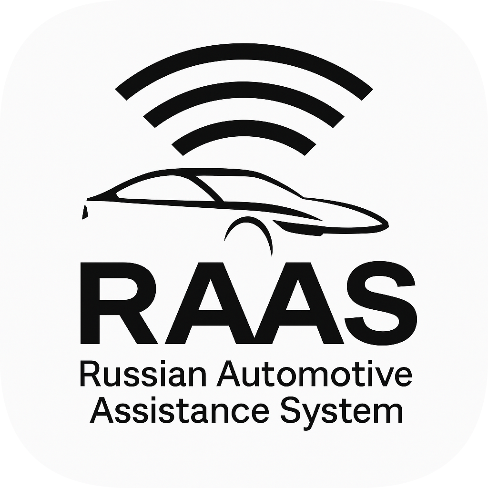
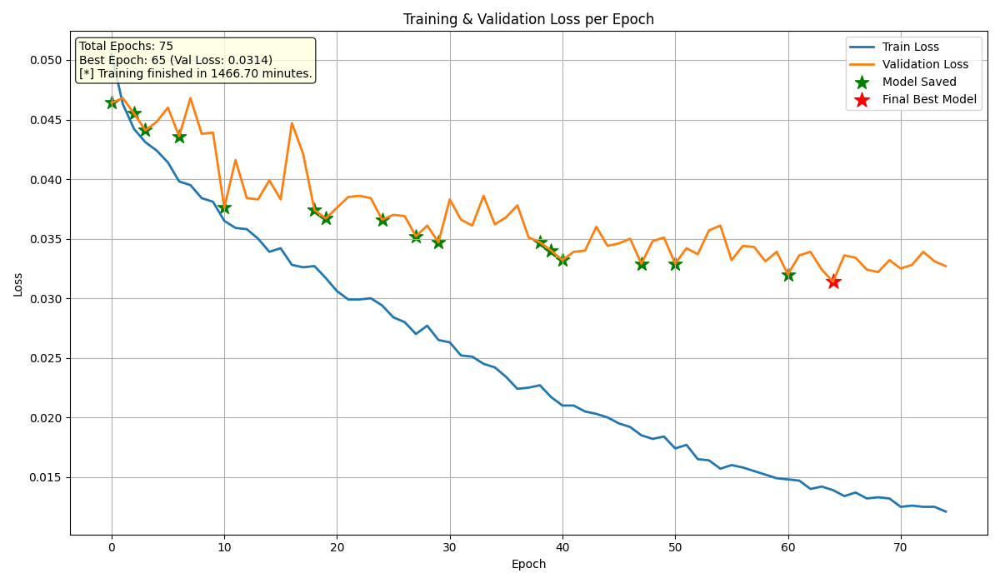

<p align="center">
  <br><br>
  <a href="https://github.com/TheAndreyZakharov/Russian-Automotive-Assistance-System/blob/main/README_RU.md">
    
  </a>
  <a href="https://github.com/TheAndreyZakharov/Russian-Automotive-Assistance-System/blob/main/README.md">
    
  </a>
</p>

<br> 

---

**Russian Automotive Assistance System (RAAS)** — это модульная система помощи водителю, разработанная на базе симулятора CARLA.  
Система спроектирована как концепт и прототип, демонстрирующий, **каким образом подобные технологии могут быть реализованы для отечественных автомобилей**, таких как Lada, Aurus и другие.

RAAS включает в себя широкий набор функций ADAS (Advanced Driver Assistance Systems), таких как автоматическая парковка, контроль слепых зон, экстренное торможение, удержание в полосе, камеры 360°, мониторинг усталости и многое другое.

Цель проекта — **предложить архитектуру, подход и техническое решение**, которые можно адаптировать под современные российские автомобили.  
Это мой личный инженерный взгляд на то, **какой могла бы быть система помощи водителю отечественной разработки** — открытая, модульная и применимая в реальной эксплуатации.

В этом файле вы найдёте **полную структуру проекта**, подробное описание работы каждого модуля, архитектуру взаимодействия компонентов, а также **визуальные примеры** функционирования системы.  
`README` служит центральной точкой входа в проект — для ознакомления, запуска, тестирования отдельных функций и понимания того, как система устроена и работает в целом.

❗️ Помимо данного описания, рекомендуется также ознакомиться с материалами в папке [`docs`](docs/), где представлены пояснительные записки, системный анализ, моделирование и обоснование проектных решений.  
Эти документы помогут лучше понять **цели проекта, его направленность, актуальность и технический контекст**, в котором разрабатывалась система.  
Для тех, кто интересуется не только реализацией, но и логикой, стоящей за архитектурой RAAS, изучение содержимого `docs` будет особенно полезным.

---

<br><br><br><br><br>

---

# 📚 Содержание

---

- [📚 Содержание](#-содержание)
    - [❗️ Важные замечания для работы системы:](#️-важные-замечания-для-работы-системы)
    - [📑 Дополнительные README файлы](#-дополнительные-readme-файлы)
    - [📌 Внимание при чтении документации](#-внимание-при-чтении-документации)
    - [❗️ Задержка при загрузке медиафайлов](#️-задержка-при-загрузке-медиафайлов)
- [🛜 Модули RAAS (raas\_func)](#-модули-raas-raas_func)
  - [🚘 Логика и функции интеллектуальной платформы помощи водителю](#-логика-и-функции-интеллектуальной-платформы-помощи-водителю)
    - [📁 Содержимое папок](#-содержимое-папок)
    - [📜 Описание скриптов](#-описание-скриптов)
    - [🎛️ Мультимедийная панель RAAS (multimedia\_panel.py)](#️-мультимедийная-панель-raas-multimedia_panelpy)
      - [▶️ Команда запуска](#️-команда-запуска)
      - [🖥️ Пример вывода в консоль](#️-пример-вывода-в-консоль)
      - [📜 Подробнее о работе скрипта](#-подробнее-о-работе-скрипта)
    - [🛣️ Система удержания в полосе (lane\_keeping\_assist.py)](#️-система-удержания-в-полосе-lane_keeping_assistpy)
      - [📜 Подробнее о работе скрипта](#-подробнее-о-работе-скрипта-1)
    - [⚠️ Система контроля слепых зон (mirror\_alert\_toggle.py)](#️-система-контроля-слепых-зон-mirror_alert_togglepy)
      - [📜 Подробнее о работе скрипта](#-подробнее-о-работе-скрипта-2)
    - [🧿 Обзор на 360 градусов с камер (camera\_360\_view.py)](#-обзор-на-360-градусов-с-камер-camera_360_viewpy)
      - [📜 Подробнее о работе скрипта](#-подробнее-о-работе-скрипта-3)
    - [🛑 Система экстренного торможения (emergency\_braking.py)](#-система-экстренного-торможения-emergency_brakingpy)
      - [📜 Подробнее о работе скрипта](#-подробнее-о-работе-скрипта-4)
    - [🚨 Автоматический вызов экстренных служб (emergency\_call\_monitor.py)](#-автоматический-вызов-экстренных-служб-emergency_call_monitorpy)
      - [📜 Подробнее о работе скрипта](#-подробнее-о-работе-скрипта-5)
    - [🛣️ Адаптивный круиз-контроль (adaptive\_cruise\_control.py)](#️-адаптивный-круиз-контроль-adaptive_cruise_controlpy)
      - [📜 Подробнее о работе скрипта](#-подробнее-о-работе-скрипта-6)
    - [🛣️ Контроль усталости водителя (driver\_fatigue\_monitor.py)](#️-контроль-усталости-водителя-driver_fatigue_monitorpy)
      - [📜 Подробнее о работе скрипта](#-подробнее-о-работе-скрипта-7)
    - [🎥 Запись видео с камер в экстренных ситуациях (camera\_recorder.py)](#-запись-видео-с-камер-в-экстренных-ситуациях-camera_recorderpy)
      - [📜 Подробнее о работе скрипта](#-подробнее-о-работе-скрипта-8)
    - [🅿️ Тестовый функционал автоматической парковки (smart\_parking.py)](#️-тестовый-функционал-автоматической-парковки-smart_parkingpy)
      - [📜 Подробнее о работе скрипта](#-подробнее-о-работе-скрипта-9)
    - [🗃️ Работа с базой данных (database\_logger.py)](#️-работа-с-базой-данных-database_loggerpy)
      - [📜 Подробнее о работе скрипта](#-подробнее-о-работе-скрипта-10)
    - [🗂️ Умная парковка (smart\_parking\_train)](#️-умная-парковка-smart_parking_train)
      - [🚗 Система автоматической парковки автомобиля на основе собственного датасета и нейросети](#-система-автоматической-парковки-автомобиля-на-основе-собственного-датасета-и-нейросети)
    - [📁 Содержимое папок](#-содержимое-папок-1)
    - [📊 Визуализация и анализ результатов обучения (plot\_training.py)](#-визуализация-и-анализ-результатов-обучения-plot_trainingpy)
      - [📜 Подробнее о работе скрипта](#-подробнее-о-работе-скрипта-11)
    - [🎥 Запись пользовательского датасета (record\_data.py)](#-запись-пользовательского-датасета-record_datapy)
      - [📜 Подробнее о работе скрипта](#-подробнее-о-работе-скрипта-12)
    - [🧠 Обучение модели автоматической парковки (train\_model.py)](#-обучение-модели-автоматической-парковки-train_modelpy)
      - [📜 Подробнее о работе скрипта](#-подробнее-о-работе-скрипта-13)
    - [🤖 Тестирование модели автоматической парковки (smart\_parking.py)](#-тестирование-модели-автоматической-парковки-smart_parkingpy)
      - [📜 Подробнее о работе скрипта](#-подробнее-о-работе-скрипта-14)
      - [🛠 Использование](#-использование)
- [🚘 Основные функции автомобиля (main\_func)](#-основные-функции-автомобиля-main_func)
  - [🧠 Основные скрипты управления и визуализации автомобиля](#-основные-скрипты-управления-и-визуализации-автомобиля)
    - [📜 Описание файлов](#-описание-файлов)
    - [🕹️ Управление автомобилем (custom\_control.py)](#️-управление-автомобилем-custom_controlpy)
      - [▶️ Команда запуска](#️-команда-запуска-1)
      - [🖥️ Пример вывода в консоль](#️-пример-вывода-в-консоль-1)
      - [📜 Подробнее о работе скрипта](#-подробнее-о-работе-скрипта-15)
    - [🪞 Отображение зеркал (side\_mirror\_cameras.py)](#-отображение-зеркал-side_mirror_cameraspy)
      - [▶️ Команда запуска](#️-команда-запуска-2)
      - [🖥️ Пример вывода в консоль](#️-пример-вывода-в-консоль-2)
      - [📜 Подробнее о работе скрипта](#-подробнее-о-работе-скрипта-16)
    - [📷 Камера с телеметрической визуализацией (camera\_telemetry.py)](#-камера-с-телеметрической-визуализацией-camera_telemetrypy)
      - [▶️ Команда запуска](#️-команда-запуска-3)
      - [🖥️ Пример вывода в консоль](#️-пример-вывода-в-консоль-3)
      - [📜 Подробнее о работе скрипта](#-подробнее-о-работе-скрипта-17)
    - [🎥 Камера с видом от третьего лица (third\_person\_camera.py)](#-камера-с-видом-от-третьего-лица-third_person_camerapy)
      - [▶️ Команда запуска](#️-команда-запуска-4)
      - [🖥️ Пример вывода в консоль](#️-пример-вывода-в-консоль-4)
      - [📜 Подробнее о работе скрипта](#-подробнее-о-работе-скрипта-18)
    - [👁️ Камера с видом от первого лица (first\_person\_camera.py)](#️-камера-с-видом-от-первого-лица-first_person_camerapy)
      - [▶️ Команда запуска](#️-команда-запуска-5)
      - [🖥️ Пример вывода в консоль](#️-пример-вывода-в-консоль-5)
      - [📜 Подробнее о работе скрипта](#-подробнее-о-работе-скрипта-19)
- [🌍 Симуляция окружения (world\_setup)](#-симуляция-окружения-world_setup)
  - [🗺️ Скрипты генерации мира, управления трафиком и объектами](#️-скрипты-генерации-мира-управления-трафиком-и-объектами)
    - [📜 Описание файлов](#-описание-файлов-1)
    - [🚦 Генерация трафика с возможностью моделирования событий (generate\_traffic\_with\_events.py)](#-генерация-трафика-с-возможностью-моделирования-событий-generate_traffic_with_eventspy)
      - [▶️ Команда запуска](#️-команда-запуска-6)
      - [🖥️ Пример вывода в консоль](#️-пример-вывода-в-консоль-6)
      - [📜 Подробнее о работе скрипта](#-подробнее-о-работе-скрипта-20)
    - [🚗 Создание автомобилей по заданным координатам из файла (spawn\_vehicles\_from\_file.py)](#-создание-автомобилей-по-заданным-координатам-из-файла-spawn_vehicles_from_filepy)
      - [▶️ Команда запуска](#️-команда-запуска-7)
      - [🖥️ Пример вывода в консоль](#️-пример-вывода-в-консоль-7)
      - [📜 Подробнее о работе скрипта](#-подробнее-о-работе-скрипта-21)
    - [🧹 Очистка симуляции от трафика (cleanup\_traffic.py)](#-очистка-симуляции-от-трафика-cleanup_trafficpy)
      - [▶️ Команда запуска](#️-команда-запуска-8)
      - [🖥️ Пример вывода в консоль](#️-пример-вывода-в-консоль-8)
      - [📜 Подробнее о работе скрипта](#-подробнее-о-работе-скрипта-22)
    - [🧨 Полное удаление всех транспортных и вспомогательных объектов (destroy\_all\_vehicles.py)](#-полное-удаление-всех-транспортных-и-вспомогательных-объектов-destroy_all_vehiclespy)
      - [▶️ Команда запуска](#️-команда-запуска-9)
      - [🖥️ Пример вывода в консоль](#️-пример-вывода-в-консоль-9)
      - [📜 Подробнее о работе скрипта](#-подробнее-о-работе-скрипта-23)
    - [🚗 Создание и инициализация транспортного средства в симуляции (spawn\_vehicle.py)](#-создание-и-инициализация-транспортного-средства-в-симуляции-spawn_vehiclepy)
      - [▶️ Команда запуска](#️-команда-запуска-10)
      - [🖥️ Пример вывода в консоль](#️-пример-вывода-в-консоль-10)
      - [📜 Подробнее о работе скрипта](#-подробнее-о-работе-скрипта-24)
    - [🗺️ Получение текущих координат активного автомобиля (get\_vehicle\_coords.py)](#️-получение-текущих-координат-активного-автомобиля-get_vehicle_coordspy)
      - [▶️ Команда запуска](#️-команда-запуска-11)
      - [🖥️ Пример вывода в консоль](#️-пример-вывода-в-консоль-11)
      - [📜 Подробнее о работе скрипта](#-подробнее-о-работе-скрипта-25)
    - [🎥 Запись логов движения и снимков для анализа (record\_controls.py)](#-запись-логов-движения-и-снимков-для-анализа-record_controlspy)
      - [▶️ Команда запуска](#️-команда-запуска-12)
      - [🖥️ Пример вывода в консоль](#️-пример-вывода-в-консоль-12)
      - [📜 Подробнее о работе скрипта](#-подробнее-о-работе-скрипта-26)
- [🖼️ Медиафайлы (static)](#️-медиафайлы-static)
  - [🖼️ Изображения, гифки и видео, используемые в системе помощи водителю](#️-изображения-гифки-и-видео-используемые-в-системе-помощи-водителю)
    - [📁 Обзор подпапок](#-обзор-подпапок)
- [📄 Документация (docs)](#-документация-docs)
  - [📑 Отчёты, системный анализ и пояснительные материалы](#-отчёты-системный-анализ-и-пояснительные-материалы)
- [⚙️ Среда разработки и зависимости](#️-среда-разработки-и-зависимости)
  - [Аппаратные характеристики, на которых разрабатывалась система:](#аппаратные-характеристики-на-которых-разрабатывалась-система)
  - [Основные используемые библиотеки:](#основные-используемые-библиотеки)
- [🙏 Благодарности](#-благодарности)
  - [🙌 Хочу поблагодарить авторов следующих проектов:](#-хочу-поблагодарить-авторов-следующих-проектов)


---

<br><br><br><br><br>

---

### ❗️ Важные замечания для работы системы:

1. **Запуск симулятора CARLA**  
   Для корректной работы системы необходимо сначала запустить **симулятор CARLA** на вашем устройстве. Симулятор должен быть полностью инициализирован и доступен для подключения.  
   ⚠️ Проект разрабатывался и протестирован на версии **CARLA 0.9.14**. Работа на других версиях не гарантируется.

2. **Спавн транспортного средства**  
   После старта симулятора необходимо создать или заспаунить транспортное средство в симуляции. Без этого шага система не сможет взаимодействовать с автомобилем.

3. **Включение мультимедии / запуск отдельных функций**  
   Мультимедийные функции и другие связанные с ними сервисы (например, камеры, датчики) могут быть активированы только после того, как транспортное средство будет заспаунено и будет находиться в симуляции. Это связано с необходимостью подключения к датчикам и камерам, которые требуют привязки к объекту автомобиля.


### 📑 Дополнительные README файлы

В проекте вы также найдете несколько README файлов, которые содержат краткие описания для соответствующих папок и их содержимого. Эти файлы помогут вам лучше ориентироваться в структуре проекта и понять назначение различных компонентов системы.

**Каждая папка проекта** содержит небольшой README файл, который объясняет, что за файлы находятся в ней и как они используются. Эти файлы написаны как на русском, так и на английском языках для удобства пользователей.

### 📌 Внимание при чтении документации

Некоторые разделы этого README-файла содержат **раскрывающиеся блоки** (`<details>`) с дополнительной информацией: описаниями функций, пояснениями по коду, логике работы и структуре файлов.  
🔽 **Будьте внимательны** и разворачивайте такие блоки, чтобы получить полное представление о системе и её возможностях.

### ❗️ Задержка при загрузке медиафайлов

Обратите внимание, что **медиафайлы (гифки и изображения)**, демонстрирующие работу различных функций системы, могут загружаться с задержкой. Это зависит от размера файлов и скорости вашего интернет-соединения.  
Под каждым медиаэлементом предусмотрена небольшая подпись с иконкой `⏳`, которая указывает, что изображение или анимация может появиться не сразу.  
Эти подписи добавлены специально, чтобы вы **не пропустили важную демонстрацию функциональности**, если визуальный контент загрузился с опозданием.

---

<br><br><br><br><br>

---

# 🛜 Модули RAAS (raas_func)

---

## 🚘 Логика и функции интеллектуальной платформы помощи водителю

Эта папка содержит **все ключевые модули**, определяющие поведение и функциональность системы помощи водителю.  
В отличие от настроек симуляции или окружения, эти скрипты реализуют **реальные функции**, включая системы безопасности, автоматизацию, работу с камерами и мультимедиа.

Структура включает отдельные модули для каждой функции, обработку экстренных ситуаций, утилиты работы с камерами и прототип системы автопарковки.


### 📁 Содержимое папок

- **`__pycache__/`**  
  Автоматически создаётся Python для кеширования скомпилированных модулей. Вручную не используется.

- **`recordings/`**  
  Содержит видеозаписи с камер автомобиля, сделанные при срабатывании экстренных событий.

  <details>
    <summary>🎥 Информация о видеозаписях происшествий</summary> 

    ⚠️ Видеозаписи с камер не включены в репозиторий (исключены через .gitignore)
    В рамках проекта выполняется **сохранение видеозаписей с камер при зафиксированных инцидентах на дороге**, охватывающих **одну минуту до и одну минуту после** события.  
    Эти файлы сохраняются в папке:
    ```
    raas_func/recordings/
    ```
    Из-за большого размера и частоты обновлений, такие видео **не коммитятся в репозиторий** — они исключены через `.gitignore` для упрощения работы и уменьшения размера проекта.
    При необходимости вы можете **скачать пример архива с видеозаписями** из раздела **[Releases](https://github.com/TheAndreyZakharov/Russian-Automotive-Assistance-System/releases)**.  
    Файл `recordings.zip` находится в разделе **Assets** последнего релиза.
    📥 Как скачать
    Перейдите:
    ```
    Releases → Последний → Assets → recordings.zip
    ```
    Затем распакуйте архив в указанную директорию.
    📁 Куда поместить видеозаписи
    После распаковки убедитесь, что все видеофайлы находятся в директории:
    ```
    raas_func/recordings/
    ```
    В этой папке **не должно быть ничего, кроме видеофайлов** — не добавляйте лишние документы или подкаталоги.
     🔧 Пути к файлам остаются актуальными
    Хотя видеозаписи не включены в репозиторий, **пути в коде остаются без изменений**.  
    После распаковки архива вся функциональность будет работать **без необходимости редактировать код**.
  </details>

- **`smart_parking_train/`**  
  Папка, содержащая всё для обучения модели автоматической парковки.  


### 📜 Описание скриптов

- **`adaptive_cruise_control.py`**  
  Реализует адаптивный круиз-контроль.

- **`camera_360_view.py`**  
  Обеспечивает обзор на 360 градусов, объединяя изображения с нескольких камер.

- **`camera_recorder.py`**  
  Управляет записью и сохранением видео с камер во время экстренных ситуаций.

- **`database_logger.py`**  
  Создаёт и обслуживает базу данных (`system_data.db`) для логирования событий.

- **`driver_fatigue_monitor.py`**  
  Отслеживает признаки усталости или невнимательности водителя с помощью видеоанализа или поведенческих данных.

- **`emergency_braking.py`**  
  Запускает экстренное торможение на основе показаний сенсоров и анализа обстановки.

- **`emergency_call_monitor.py`**  
  Автоматически вызывает экстренные службы при серьёзных происшествиях.

- **`lane_keeping_assist.py`**  
  Поддерживает движение в пределах полосы, предупреждает или корректирует отклонения.

- **`mirror_alert_toggle.py`**  
  Отвечает за предупреждения о транспорте в слепых зонах и отображение сигналов в зеркалах.

- **`multimedia_panel.py`**  
  Управляет мультимедийным интерфейсом водителя (аудио, визуальный вывод, меню и пр.).

- **`smart_parking.py`**  
  Прототип функции автоматической парковки — автомобиль ищет место и паркуется самостоятельно с помощью обученной модели.

- **`system_data.db`**  
  Файл базы данных SQLite для хранения логов системы, событий и пользовательских данных.


Эта директория — **основа всей функциональной логики** системы помощи водителю. Каждый модуль отвечает за конкретную **реальную функцию, повышающую безопасность, комфорт или автоматизацию управления**.


---

<br>

### 🎛️ Мультимедийная панель RAAS (multimedia_panel.py)

<p align="center">
    
</p>
<p align="center"><em>⏳ Гифка может загружаться несколько секунд — дождитесь появления анимации</em></p>


#### ▶️ Команда запуска
```
python multimedia_panel.py
```

#### 🖥️ Пример вывода в консоль
```
pygame 2.6.1 (SDL 2.28.4, Python 3.7.0)
Hello from the pygame community. https://www.pygame.org/contribute.html
[*] Emergency Call Monitor disabled.
[+] Подключено к машине: vehicle.lincoln.mkz_2020 (ID 24)
[*] Press Q to exit.
```

📁 На гифке показан основной интерфейс панели, включающий управление функциями, просмотр основных экранов, настройки и просмотр функционала.

Мультимедийная панель — это **централизованный графический интерфейс пользователя (GUI)**, реализованный с помощью `PyQt5`, обеспечивающий доступ к функциям системы RAAS.  
Она служит связующим звеном между пользователем и всеми интеллектуальными подсистемами автомобиля.

#### 📜 Подробнее о работе скрипта

<details>
<summary>📜 Подробнее о работе скрипта</summary>


**Структура и инициализация:**

* Класс `RAASPanel` наследуется от `QWidget` и представляет **основное окно приложения** с фиксированным разрешением `1280x720`.
* При запуске:
  - Подключается к симулятору CARLA (`localhost:2000`);
  - Ищет первую доступную машину из списка актёров (`vehicle.*`);
  - Загружает все визуальные ресурсы (фон, иконки, гифки);
  - Запускает систему камер (`Camera360`) и буфер записи (`CameraBufferRecorder`);
  - Инициализирует остальные модули: экстренный вызов (`EmergencyCallMonitor`), контроль усталости, авто-торможение, круиз-контроль и смарт-парковка.


**Экранная навигация:**

* Панель использует **механизм стеков (`QStackedWidget`)**:
  - Каждый экран — это отдельный `QWidget` (например, `main_screen`, `view360_screen`, `functions_screen`);
  - Навигация осуществляется кнопками и жестами (например, свайп вверх с экрана приветствия);
  - Интерфейс разделён на:
    - **Top bar** — часы и дата;
    - **Sidebar** — быстрый доступ к приложениям;
    - **Bottom bar** — музыка, управление, громкость.


**Встроенные модули и взаимодействие:**

Панель RAAS координирует **активацию и выключение функций**, а также отображает их состояния:

- `Camera360` — режим кругового обзора, автоматически активируется при включении задней передачи или вручную;
- `EmergencyCallMonitor` — реагирует на резкие столкновения и запускает таймер обратного отсчёта вызова 112;
- `DriverFatigueMonitor` — отслеживает активность водителя и сигнализирует об усталости;
- `AutoBrakingSystem` — автоматически активирует торможение при опасном сближении;
- `SmartParkingModule` — распознаёт парковочные зоны и запускает манёвр;
- `AdaptiveCruiseControl` — удерживает заданную скорость, включая автоматическое торможение/ускорение.

Каждый из модулей может быть **включён или отключён вручную** в разделе “Функции”, при этом интерфейс:
- Меняет цвет кнопки (зелёный — включено, серый — выключено);
- Показывает подтверждение перед отключением;
- Сохраняет состояние в базу данных.


**Режим 360° камеры:**

* Автоматически переключается при включении задней передачи;
* Отображается пара: общий обзор (`display_left`) и выбранная камера (`display_right`);
* Камеры выбираются нажатием на соответствующую прозрачную область на обзоре (спереди, сзади, слева, справа).


**Smart Parking:**

* Панель визуализирует поток с 4 камер и автоматически определяет возможность парковки;
* Кнопка “Выполнить парковку” активна, только если рядом обнаружено допустимое парковочное место;
* При старте парковки запускается `QThread`, который пошагово воспроизводит траекторию движения;
* Возможна ручная отмена по кнопке “Стоп” или клавишей `P`.


**Адаптивный круиз-контроль:**

* Включается вручную из отдельного экрана;
* Позволяет изменять скорость удержания с шагом 5 км/ч;
* Автоматически тормозит при приближении к другим объектам (через лидера CARLA).


**Сохраняемые состояния:**

При каждом изменении состояния функций или при запуске/выходе из системы RAAS панель логирует это:


**Что сохраняется в базе данных?**

1. **Таблица состояний функций** — `function_states`:
   - `function_name` — имя функции (`lane_assist`, `mirror_alerts`, `auto_braking`, и т.д.);
   - `state` — `"ON"` или `"OFF"`;
   - `timestamp` — точная дата и время изменения.

2. **Таблица сессий системы** — `system_sessions`:
   - `event` — `"start"` или `"stop"`;
   - `timestamp` — момент включения или выключения мультимедийной панели.

Эти данные позволяют:
- Восстанавливать прежние состояния при следующем запуске;
- Анализировать использование функций водителем;
- Вести полную хронологию активности системы.

</details>

---

<br><br><br>

### 🛣️ Система удержания в полосе (lane_keeping_assist.py)

<p align="center">
    
</p>
<p align="center"><em>⏳ Гифка может загружаться несколько секунд — дождитесь появления анимации</em></p>

▶️ **Функция включается/отключается вручную через мультимедийную панель в разделе “Функции”**.  
📁 На гифке представлен пример работы системы удержания автомобиля в пределах дорожной полосы с визуализацией отклонения и корректирующего воздействия.

Система удержания в полосе отслеживает положение автомобиля относительно центральной линии полосы движения и при необходимости **плавно корректирует рулевое управление**, чтобы удерживать транспортное средство в пределах своей полосы.  
Для этого используется PID-контроллер, а визуализация происходит в отдельном окне с отображением полос и смещения относительно центра камеры.

#### 📜 Подробнее о работе скрипта

<details>
<summary>📜 Подробнее о работе скрипта</summary>

* Запуск функции осуществляется через обычный Python-скрипт с использованием библиотеки `pygame` для интерфейса и `cv2` для обработки изображения с камеры.
* Камера RGB устанавливается на автомобиле с высотой 2.4м и снимает вид вперёд.
* Параллельно отображается интерфейс с текущими параметрами: скорость, угол руля, передачи, поворотники, и флаг работы системы удержания в полосе (`Lane Assist`).
* Основной алгоритм работает следующим образом:
  * Камера получает изображение в реальном времени.
  * С помощью OpenCV обрезается нижняя часть кадра (ROI), преобразуется в градации серого, размазывается и проходит через детектор границ Canny.
  * Далее применяется `HoughLinesP`, чтобы найти потенциальные линии разметки. Разделяются на левые и правые по углу наклона.
  * Отмечаются визуально цветами: красным — левая полоса, зелёным — правая, синим — центр камеры, жёлтым — вычисленный центр полосы.
* Для управления используется PID-контроллер, получающий в качестве ошибки отклонение от центра полосы.  
  Корректировка угла поворота руля происходит плавно, с учётом прошедшего времени между кадрами (`dt`).
* При включённых поворотниках (`Q`, `E`, `Z`) система временно отключается, чтобы не мешать манёврам.
* Если водитель не активировал `Lane Assist`, управление осуществляется вручную (`A` / `D`).
* Выход из программы происходит по нажатию `Q` или закрытию окна Pygame.

Таким образом, скрипт реализует **базовую систему удержания автомобиля в полосе**, обеспечивающую корректирующее рулевое воздействие на основе визуального анализа разметки и навигационной информации от CARLA.

</details>

---

<br><br><br>

### ⚠️ Система контроля слепых зон (mirror_alert_toggle.py)

<p align="center">
    
</p>
<p align="center"><em>⏳ Гифка может загружаться несколько секунд — дождитесь появления анимации</em></p>


▶️ **Функция включается/отключается вручную через мультимедийную панель в разделе “Функции”**.  
📁 На гифке показан пример визуального оповещения водителя при обнаружении объекта в мёртвой зоне по данным радара.

Система контроля слепых зон отслеживает пространство по бокам автомобиля с помощью **радаров короткого действия** и отображает визуальные предупреждения при обнаружении препятствий.  
Это позволяет своевременно предупредить водителя о наличии автомобиля или другого объекта в опасной зоне, особенно при перестроении.

#### 📜 Подробнее о работе скрипта

<details>
<summary>📜 Подробнее о работе скрипта</summary>

* Подключается к симулятору CARLA и получает доступ к ближайшему автомобилю.
* Устанавливаются **две RGB-камеры**: по левому и правому борту, направленные под углом назад, имитируя боковые зеркала заднего вида.
* Визуализация формируется на основе данных этих камер и выводится на экран как сдвоенное окно (`cv2.imshow`) с изображением слева и справа.
* Дополнительно устанавливаются **два радара** (левый и правый) с малым углом обзора и дальностью 6 метров.
* При регистрации объектов в пределах зоны обнаружения (до 10 м) со стороны соответствующего радара:
  * На изображение накладывается иконка предупреждения (`alert_icon.png`);
  * Записывается событие в базу данных.
* Иконка отображается полупрозрачно, с альфа-каналом, в левом или правом верхнем углу изображения.
* Скрипт проверяет, чтобы не записывать повторяющиеся события — ведётся контроль состояния последнего срабатывания по каждому радару.
* Завершение работы осуществляется по клавише `Q`, при этом камеры и радары корректно останавливаются и уничтожаются.

Таким образом, реализована **реалистичная система мониторинга мёртвых зон**, которая реагирует на появление объектов рядом с автомобилем и уведомляет водителя визуально, при этом ведя лог событий для последующего анализа.

🗂️ **Что сохраняется в базе данных?**

Каждое срабатывание радара фиксируется в таблице `mirror_alerts` SQLite-базы данных:

* `side` — сторона срабатывания (`left` или `right`);
* `timestamp` — момент обнаружения объекта.

Эти данные позволяют **отслеживать частоту и сторону появления препятствий**, а также проводить ретроспективный анализ для обучения моделей или анализа поведения водителя.


</details>

---

<br><br><br>


### 🧿 Обзор на 360 градусов с камер (camera_360_view.py)

<p align="center">
    
</p>
<p align="center"><em>⏳ Гифка может загружаться несколько секунд — дождитесь появления анимации</em></p>


▶️ **Функция автоматически активируется при включении заднего хода** или через **мультимедийную панель**, обеспечивая водителю полный контроль над окружающей обстановкой во время парковки или маневрирования в ограниченном пространстве.  
📁 На гифке представлено меню функции в мультимедии и взаимодействие с ним.

Функция визуализирует круговой обзор автомобиля, объединяя изображения с четырёх внешних камер — спереди, сзади, слева и справа.  
На экране формируется **единая панорама с видом сверху**, имитирующая реальный 360° обзор, как в современных автомобилях.

#### 📜 Подробнее о работе скрипта

<details>
<summary>📜 Подробнее о работе скрипта</summary>

* Класс `Camera360` создаётся с привязкой к `vehicle`, `world`, а также, опционально, к объекту `CameraBufferRecorder` для записи кадров.
* В методе `start()` происходит:
  * Загрузка шаблона RGB-камеры (разрешение 320×240, угол обзора 120°);
  * Установка 4 камер:
    - **front**: перед авто (`yaw=0`);
    - **back**: сзади (`yaw=180`);
    - **left** и **right**: сбоку слева и справа (`yaw=±90`);
  * Каждая камера закрепляется к автомобилю и начинает передавать данные в `camera_callback`.
* В `camera_callback()`:
  * изображение преобразуется в NumPy-массив → RGB → Pygame Surface;
  * сохраняется в `self.image_data[key]`;
  * при наличии рекордера — кадры также сохраняются в буфер.
* Метод `get_surface()` объединяет изображения:
  * камеры интерпретируются как видимые с высоты (bird-eye view);
  * кадры искажаются: фронтальные сужаются снизу, задние — сверху, боковые поворачиваются и искажаются как трапеции;
  * автомобиль отображается в центре (загружается изображение `car_above.jpg`);
  * итог — формируется панорама 1000×800 пикселей с четырёх сторон.
* Все трансформации выполняются через OpenCV:
  * перспективные искажения (`cv2.getPerspectiveTransform`, `warpPerspective`);
  * повороты, зеркалирование, ресайз.
* Метод `stop()` удаляет все камеры, завершает приём изображений и очищает список акторов.

Таким образом, этот модуль имитирует **настоящую систему кругового обзора**, значительно повышая ситуационную осведомлённость водителя и снижая вероятность ошибок при парковке.

</details>

---

<br><br><br>

### 🛑 Система экстренного торможения (emergency_braking.py)

<p align="center">
  
  
  
</p>
<p align="center"><em>⏳ Гифки (3 шт.) могут загружаться несколько секунд — дождитесь появления анимаций</em></p>


▶️ **Функция включается/отключается вручную через мультимедийную панель в разделе “Функции”**.  
📁 На гифках представлены реальные моменты срабатывания системы при обнаружении препятствий на пути автомобиля.

Система экстренного торможения отвечает за **автоматическое снижение скорости вплоть до полной остановки автомобиля**, если спереди фиксируется объект на опасной дистанции.  
Работа системы основывается на данных LiDAR, при этом учитывается текущая скорость автомобиля, положение препятствия и его относительное расстояние.

Если объект оказывается слишком близко — срабатывает экстренное торможение, которое сохраняет автомобиль от столкновения.  
Дополнительно автоматически запускается **модуль записи видео с камер**, чтобы зафиксировать всю ситуацию в архив (до и после момента торможения).

#### 📜 Подробнее о работе скрипта

<details>
<summary>📜 Подробнее о работе скрипта</summary>

* Класс `AutoBrakingSystem` инициализируется с доступом к текущему миру CARLA (`world`) и автомобилю (`vehicle`), а также, при наличии, к панели RAAS.
* Метод `start()` инициализирует сенсор LiDAR:
  - диапазон — до 50 метров;
  - частота — 20 Гц;
  - плотность точек — до 300 тыс. точек в секунду.
* Обработка данных осуществляется в методе `lidar_callback()`:
  - из каждой LiDAR-точки извлекается расстояние до объекта;
  - если объект спереди ближе критической дистанции — начинается торможение.
* При срабатывании:
  - скорость автомобиля сбрасывается до нуля (`apply_emergency_brake`);
  - данные о событии фиксируются в базу данных;
  - если подключён 360° модуль с записью — активируется видеофиксация ситуации.
* Если авто полностью остановилось и прошло более 1 секунды — торможение отключается (`release_brake`).
* Метод `stop()` завершает работу сенсора и возвращает управление пользователю.

🗂️ **Что сохраняется в базу данных?**

При каждом срабатывании системы экстренного торможения данные записываются в таблицу `emergency_brakes`:

- `timestamp` — время срабатывания;
- `speed_kmh` — скорость автомобиля на момент срабатывания;
- `distance_m` — расстояние до препятствия, вызвавшего торможение.

Эти данные служат основой для **анализа дорожных ситуаций, отчётов о безопасности и корректности работы системы**.

</details>

---

<br><br><br>


### 🚨 Автоматический вызов экстренных служб (emergency_call_monitor.py)

<p align="center">
  
  
</p>

<p align="center">
  
</p>

<p align="center"><em>⏳ Гифки (3 шт.) могут загружаться несколько секунд — дождитесь появления анимаций</em></p>

▶️ **Функция включается/отключается вручную через мультимедийную панель в разделе “Функции”**.  
📁 На гифках представлены возможные сценарии: принятие вызова вручную, отклонение пользователем, и автоматический дозвон после 60 секунд ожидания.

Модуль автоматического вызова экстренных служб в RAAS предназначен для **реагирования на возможные аварийные ситуации на дороге**.  
При резком торможении и/или изменении курса автомобиля система фиксирует возможное ДТП и предлагает водителю подтвердить вызов по номеру 112.  
Если в течение 60 секунд не будет принято решение — звонок будет инициирован автоматически.

Данная система ориентирована на **повышение безопасности водителя в экстренных ситуациях** и работает в тесной связке с системой 360° обзора, активируя видеозапись происходящего для последующего анализа.

#### 📜 Подробнее о работе скрипта

<details>
<summary>📜 Подробнее о работе скрипта</summary>

* Класс `EmergencyCallMonitor` запускается как виджет в составе мультимедийной панели.
* В конструкторе (`__init__`) определяются пороговые значения:
  * `speed_drop_threshold` — минимальное падение скорости для срабатывания (по умолчанию 30 км/ч);
  * `angle_change_threshold` — минимальное изменение направления движения (по умолчанию 60 градусов).
* Таймер `QTimer` проверяет состояние автомобиля каждые 0.2 секунды (`monitor_vehicle()`):
  * Если происходит резкое падение скорости и/или изменение направления — система фиксирует возможное ДТП.
* При срабатывании открывается графическое окно:
  * Предлагается подтвердить вызов или отклонить его;
  * Одновременно стартует 60-секундный обратный отсчёт;
  * Если пользователь не реагирует — система автоматически инициирует звонок в экстренные службы.
* В момент подтверждения или отклонения вызова:
  * Все параметры происшествия (скорости, углы, координаты) сохраняются в базу данных;
  * Также фиксируется факт вызова: был ли он выполнен или отменён;
  * Запускается модуль видеозаписи, если в системе активен 360° обзор.
* Функция может быть остановлена через метод `stop()`, который завершает все таймеры и скрывает окно.

🗂️ **Что сохраняется в базу данных?**

Каждое зафиксированное срабатывание системы записывается в таблицу `emergency_calls`:

- `timestamp` — момент фиксации аварии;
- `speed_before` и `speed_after` — скорость до и после события;
- `speed_drop` — разница между ними;
- `yaw_before` и `yaw_after` — углы поворота до и после события;
- `yaw_change` — абсолютное изменение курса;
- `duration_sec` — сколько времени прошло до момента реакции;
- `location_x`, `location_y`, `location_z` — координаты в момент происшествия;
- `call_made` — значение `1`, если звонок был сделан, или `0`, если отменён.

Эти данные используются для **формирования отчётов, анализа аварийных ситуаций и документирования работы системы безопасности**.

</details>


---

<br><br><br>

### 🛣️ Адаптивный круиз-контроль (adaptive_cruise_control.py)

<p align="center">
    
</p>

<p align="center"><em>⏳ Гифка может загружаться несколько секунд — дождитесь появления анимации</em></p>


▶️ **Эта функция запускается через мультимедийную панель управления.**  
📁 На гифке представлено меню функции в мультимедии и взаимодействие с ним.

Функция включает автоматическую поддержку заданной скорости движения автомобиля, учитывая текущую скорость и поведение водителя.  
**Адаптивный круиз-контроль активируется через мультимедийную панель системы RAAS** и позволяет плавно управлять ускорением и торможением в зависимости от условий.

Система помогает **снизить нагрузку на водителя во время движения по прямой**, поддерживает безопасность, отключается при торможении вручную и записывает логи своей работы в базу данных.

#### 📜 Подробнее о работе скрипта

<details>
<summary>📜 Подробнее о работе скрипта</summary>

* Класс `AdaptiveCruiseControl` инициализируется с привязкой к объекту автомобиля (`vehicle`) и текущему миру CARLA (`world`).
* По умолчанию система выключена (`self.enabled = False`), скорость и минимальная дистанция инициализированы.
* Установка и изменение целевой скорости:
  * Метод `set_target_speed(speed_kmh)` устанавливает целевую скорость (30–150 км/ч);
  * Методы `increase_speed()` и `decrease_speed()` увеличивают/уменьшают её на 5 км/ч.
* Активация круиз-контроля происходит через `enable()`, при этом:
  * записывается лог в базу данных;
  * выводится сообщение в консоль.
* При нажатии на тормоз или при явном отключении вызывается `disable()` — круиз-контроль останавливается и записывает событие в базу.
* Метод `update()` вызывается в основном цикле управления автомобилем и работает, только если система включена:
  * При ручном торможении — система отключается;
  * При ручном разгоне (если превышает целевую скорость) — не вмешивается;
  * Иначе — автоматически регулирует значение газа и тормоза, чтобы приблизиться к заданной скорости.
* Управление применяется к автомобилю через `vehicle.apply_control()` с сохранением остальных параметров (`руль`, `передача`, `ручник` и др.).
* Заглушка `get_closest_vehicle_ahead()` предназначена для возможного расширения функционала до полноценной адаптивной системы с дистанцией до впереди идущих авто.

🗂️ **Что записывается в базу данных?**

При включении и выключении круиз-контроля система автоматически сохраняет информацию в таблицу `cruise_control` SQLite-базы:

- `action` — тип события: `'enabled'` или `'disabled'`;  
- `timestamp` — текущая дата и время события;  
- `speed_kmh` — фактическая скорость автомобиля на момент включения/отключения.

Это необходимо для **отслеживания истории активации круиз-контроля**, анализа поведения водителя, построения отчётов и последующего аудита системы.

</details>

---

<br><br><br>

### 🛣️ Контроль усталости водителя (driver_fatigue_monitor.py)

<p align="center">
    
</p>

<p align="center"><em>⏳ Гифка может загружаться несколько секунд — дождитесь появления анимации</em></p>


▶️ **Функция включается/отключается вручную через мультимедийную панель в разделе “Функции”**.  
📁 На гифке представлен один из примеров уведомлений водителя, когда система фиксирует длительное отсутствие реакции на управление, чтобы напомнить о необходимости отдыха.


Функция мониторинга усталости водителя отслеживает поведение водителя за рулём, выявляя признаки усталости на основе его действий, таких как частые резкие повороты руля, частые пересечения разметки без поворотников, длительное вождение без пауз и отсутствие реакции на авто-пилот или круиз-контроль.  
**Контроль усталости водителя активируется/деактивируется вручную через мультимедийную панель в разделе “Функции” системы RAAS**.

При обнаружении потенциальных признаков усталости, система будет **предупреждать водителя**, а также записывать все события в базу данных для последующего анализа.

#### 📜 Подробнее о работе скрипта

<details>
<summary>📜 Подробнее о работе скрипта</summary>

* Класс `DriverFatigueMonitor` инициализируется с привязкой к объекту автомобиля (`vehicle`) и, при необходимости, графическому интерфейсу (GUI) для отображения предупреждений.
* Внутри класса сохраняются несколько переменных:
  - `trip_start_time`: время начала поездки;
  - `last_driver_input_time`: время последнего ввода водителя;
  - `last_steer`: предыдущие значения угла руля для анализа резких движений.
* В методе `update_driver_input` осуществляется обработка:
  - отсутствие действий водителя более 60 секунд;
  - контроль за работой круиз-контроля и системы удержания полосы;
  - длительное вождение (более 100 минут).
* В случае, если водитель совершает слишком частые резкие повороты руля или пересекает разметку без сигналов, система **выдаёт предупреждение**.
* Также учитываются и другие факторы, такие как активированные системы автопилота и круиз-контроля.
* Каждое предупреждение записывается в базу данных через метод `log_fatigue_warning`.

🗂️ **Что сохраняется в базе данных?**

При каждом событии, связанном с усталостью водителя, система записывает информацию в таблицу `fatigue_warnings` базы данных:

- `timestamp` — точная временная метка события;
- `reason` — причина предупреждения (например, "Отсутствие действий водителя" или "Частые резкие повороты руля");
- `category` — категория события, например: "no_input" (отсутствие ввода), "long_drive" (длительное вождение), "steering" (резкие повороты руля).

Эти записи необходимы для **анализа поведения водителя**, статистики усталости и создания отчетов по работе системы помощи водителю.

</details>


---

<br><br><br>

### 🎥 Запись видео с камер в экстренных ситуациях (camera_recorder.py)

<p align="center">
    
</p>

<p align="center"><em>⏳ Гифка может загружаться несколько секунд — дождитесь появления анимации</em></p>

Функция обеспечивает автоматическую запись видео с камер автомобиля при возникновении экстренных событий.  
Она позволяет сохранить видео **до и после инцидента**, включая визуальные данные, метки времени и текущую скорость автомобиля.

▶️ **Функция включается/отключается вручную через мультимедийную панель в разделе “Функции”**.  
📁 На гифке показан пример работы системы. Полные видеофайлы записей выложены в разделе **Releases** репозитория и доступны для загрузки.

#### 📜 Подробнее о работе скрипта

<details>
<summary>📜 Подробнее о работе скрипта</summary>

* Класс `CameraBufferRecorder` инициализируется с параметрами:
  - `camera_keys` — список имён камер (например, `'front'`, `'back'`);
  - `fps` — частота кадров (по умолчанию 30);
  - `buffer_seconds` — длительность буфера (по умолчанию 60 секунд до события);
  - `post_seconds` — длительность записи после события (по умолчанию 60 секунд).
* При запуске инициализируется подключение к симулятору CARLA и находится первый доступный автомобиль.
* Внутри создаётся кольцевой буфер `deque` для каждой камеры, ограниченный по длительности (`buffer_seconds × fps`), в который поступают кадры вместе с:
  - временем съёмки;
  - текущей скоростью автомобиля (в км/ч).
* Метод `add_frame(key, frame)` вызывается из каждого модуля камеры и добавляет очередной кадр в соответствующий буфер.
* При активации события (`trigger_event_recording()`):
  * снимки из буфера сохраняются локально;
  * параллельно начинается запись `post_seconds` видео;
  * все кадры (до и после события) объединяются;
  * на каждый кадр накладывается:
    - дата и время;
    - текущая скорость;
  * создаётся `.mp4` файл с именем по дате (`YYYYMMDD_HHMMSS_key.mp4`) в директории `recordings/`.
* Видео кодируются с помощью `cv2.VideoWriter`, искажения размеров исправляются при необходимости, используется кодек `'mp4v'`.

Таким образом, система обеспечивает **непрерывное видеонаблюдение**, с возможностью сохранения видео **до и после критического момента**, как в настоящих автомобильных "чёрных ящиках".

</details>


---

<br><br><br>


### 🅿️ Тестовый функционал автоматической парковки (smart_parking.py)

<p align="center">
    
</p>

<p align="center"><em>⏳ Гифка может загружаться несколько секунд — дождитесь появления анимации</em></p>

▶️ **Функция включается/отключается вручную через мультимедийную панель**.  
📁 На гифке показан пример автоматического поиска парковочных мест с визуальной разметкой и распознаванием зоны.

Система автоматической парковки реализует **тестовый функционал интеллектуального поиска и выполнения манёвра парковки**, основываясь на камерах, заранее заданных координатах парковочных мест и заранее записанном маршруте движения.  
Режим активно задействует обработку изображений в реальном времени для определения наличия парковочной зоны и, при необходимости, выполняет манёвр парковки без участия водителя.

#### 📜 Подробнее о работе скрипта

<details>
<summary>📜 Подробнее о работе скрипта</summary>

* Класс `SmartParkingModule` инициализируется с объектами `world` и `vehicle` из CARLA.
* Устанавливаются **четыре камеры** (спереди, сзади, слева, справа) с углом обзора 120°, данные с которых используются для визуального анализа.
* Список предполагаемых **парковочных точек** (`PARKING_SPOTS`) заранее задан и определяется по расстоянию от автомобиля:
  * Если расстояние до точки < 8 метров — система считает парковочное место доступным.
* При обнаружении парковочной зоны с нужной стороны (левая или правая) камера визуально маркирует зону парковки, а состояние сохраняется.

**Обработка изображения:**
* Используются маски по цвету (белые и жёлтые линии разметки);
* Производится детекция линий через `cv2.HoughLinesP`;
* Также рассчитывается центр масс для нахождения разметки и центрируется визуальный индикатор на экране.

**Выполнение парковки:**
* Загружается соответствующий `pathX.json`, где X — это ID парковочного места;
* Перед выполнением — автомобиль подъезжает к стартовой точке маршрута;
* После этого, в реальном времени:
  * Считываются данные по временным меткам;
  * Применяются значения `throttle`, `steer`, `brake`, `gear` и др., считываемые из файла;
  * Движение синхронизируется с тактом `world.tick()` в CARLA.
* В любой момент манёвр может быть **принудительно прерван** (например, по кнопке в интерфейсе).
* После завершения скрипт подаёт тормоз и фиксирует окончание парковки.

🗂️ **Что сохраняется в базе данных?**

При запуске и завершении процедуры парковки система записывает информацию в таблицу `smart_parking` базы данных:

* `action` — `'start'` при начале и `'stop'` при завершении парковки;
* `timestamp` — временная метка события;
* `side` — сторона парковки (`left` или `right`), в зависимости от положения свободного места.

Эти записи позволяют **отслеживать, когда и с какой стороны происходили попытки автоматической парковки**, использовать данные для последующего анализа или обучения моделей.

</details>

---

<br><br><br>


### 🗃️ Работа с базой данных (database_logger.py)

Функция представляет собой систему для логирования различных событий и состояний в процессе работы системы RAAS, с сохранением данных в базе данных SQLite.  
Эта база данных используется для **отслеживания состояний функций системы, событий мультимедиа**, а также других важных параметров, таких как экстренное торможение, события радаров зеркал, круиз-контроль и другие важные действия.

Система помогает **сохранять информацию о критичных моментах работы системы** и предоставляет возможности для анализа и аудита работы автомобиля и системы помощи водителю.

#### 📜 Подробнее о работе скрипта

<details>
<summary>📜 Подробнее о работе скрипта</summary>

* Класс `DatabaseLogger` создаёт подключение к базе данных SQLite и инициализирует несколько таблиц для хранения информации:
  - `function_states`: таблица для логирования состояний различных функций системы (включение/выключение);
  - `system_sessions`: таблица для записи событий начала и завершения мультимедийных сессий;
  - `mirror_alerts`: таблица для событий радаров зеркал (оповещения о наличии препятствий в слепых зонах);
  - `emergency_brakes`: таблица для экстренного торможения, включая скорость и расстояние до объекта;
  - `cruise_control`: таблица для записей состояний круиз-контроля;
  - `smart_parking`: таблица для логирования активных процессов умной парковки;
  - `emergency_calls`: таблица для записи данных экстренных вызовов (скорость, углы, продолжительность, локация);
  - `fatigue_warnings`: таблица для логирования предупреждений о усталости водителя.

* При создании экземпляра класса выполняется подключение к базе данных и создание указанных таблиц, если они не существуют.

* Все логируемые данные сохраняются в таблицы базы данных с привязкой к текущему времени:
  - Для каждого события система записывает:
    - `timestamp`: временную метку, фиксирующую время события;
    - дополнительные параметры (например, скорость, состояние функций, местоположение и т. д.).

* Пример методов для записи событий:
  - `log_function_state(function_name, state)`: записывает состояние функции (например, "enabled" или "disabled");
  - `log_system_event(event)`: записывает события начала/конца мультимедийной сессии ("start" или "stop");
  - `log_mirror_alert(side)`: записывает предупреждения с радаров зеркал (левый или правый);
  - `log_emergency_brake(speed_kmh, distance_m)`: логирует экстренные торможения, включая скорость и расстояние до объекта;
  - `log_cruise_control(action, speed_kmh)`: сохраняет события активации/деактивации круиз-контроля;
  - `log_smart_parking(action, side=None)`: записывает события умной парковки (включение/выключение и сторону);
  - `log_emergency_call(...)`: записывает данные экстренных ситуаций, включая параметры скорости, углов и локации;
  - `log_fatigue_warning(reason, category)`: записывает предупреждения о состоянии усталости водителя.

* Метод `get_last_states()` позволяет получить последние состояния всех функций, что позволяет в любой момент времени получить актуальное состояние системы.

* Для защиты от одновременных обращений к базе данных используется блокировка через `threading.Lock()`.

Таким образом, эта система **позволяет собирать подробную информацию о функционировании всех ключевых компонентов системы помощи водителю** и предоставляет возможности для анализа, аудита и дальнейшей оптимизации работы всех подсистем.

</details>

---

<br><br><br>

### 🗂️ Умная парковка (smart_parking_train)

#### 🚗 Система автоматической парковки автомобиля на основе собственного датасета и нейросети

Эта папка содержит все необходимые компоненты для **обучения, оценки и тестирования** модели глубокого обучения, выполняющей автоматическую парковку.  
Внутри — инструменты для сбора данных, сам датасет, скрипты обучения, сохранённые модели и утилиты для визуализации результатов.

Структура папки отражает полный цикл работы над моделью:  
от **записи данных** ➝ к **обучению** ➝ к **тестированию** ➝ и **анализу результатов**.


### 📁 Содержимое папок

- **`__pycache__/`**  
  Папка, автоматически создаваемая Python для кеширования скомпилированных модулей. Не используется вручную.

- **`dataset/`**  
  Содержит полный датасет, использованный для обучения — изображения с камер и CSV-файл с телеметрией.

    <details>
        <summary>📂 Информация о датасете</summary> 
    📂 Датасет для парковки  

    🧪 Собственный датасет для обучения модели автоматической парковки  

    Эта папка содержит **самостоятельно собранный датасет**, использованный для обучения модели, выполняющей автоматическую парковку.    

    Данные были собраны в ходе ручной парковки автомобиля с использованием камер и датчиков в разных сценариях.  

    В датасете присутствуют **изображения с камер** и **телеметрическая информация**, что делает его пригодным как для моделей компьютерного зрения, так и для анализа сенсорных данных.  

    📁 Структура датасета
        - **`log.csv`**  
        CSV-файл с телеметрией автомобиля, синхронизированной по времени. Включает следующие параметры:
        - `frame`: Номер кадра в последовательности  
        - `throttle`: Значение акселерации  
        - `steer`: Значение поворота руля  
        - `brake`: Значение торможения  
        - `speed`: Скорость автомобиля  
        - `front_dist`: Расстояние до препятствия спереди  
        - `back_dist`: Расстояние до препятствия сзади  
        - `left_dist`: Расстояние до препятствия слева  
        - `right_dist`: Расстояние до препятствия справа    
    
    Этот файл представляет собой числовые данные управления и сенсоров для обучения модели.

    - **`images/`**  
    Папка с изображениями, сделанными камерами автомобиля во время сессий парковки.  
    Каждое изображение связано с конкретным кадром в `log.csv` и даёт визуальный контекст.  
    📸 Информация о датасете изображений  
    ⚠️ Собственный датасет изображений не включён в репозиторий (исключён через .gitignore)  
    Для этого проекта был создан собственный **датасет изображений**, содержащий **более 13 000 PNG-файлов (~1.5 ГБ)**.    
    Чтобы избежать превышения ограничений GitHub по размеру и производительности, папка с изображениями **исключена из контроля версий с помощью `.gitignore`**.  
    Таким образом, сами изображения **не отслеживаются Git'ом** и **не включены в репозиторий**, но код всё ещё ожидает, что они будут находиться локально в нужной директории.  
    Вы можете **скачать полный архив изображений** в разделе **[Releases](https://github.com/TheAndreyZakharov/Russian-Automotive-Assistance-System/releases)**.    
    Файл `images.zip` находится в разделе **Assets** последнего релиза.  
    📥 Как скачать  
    Перейдите:
        ```
        Releases → Последний → Assets → images.zip
        ```  
    Затем распакуйте архив в нужную локальную папку.  
    📁 Расположение изображений  
    После распаковки архива убедитесь, что **все PNG-изображения находятся в той же папке, где расположен этот файл `README.md`**.    
    В этой папке **не должно быть ничего, кроме изображений** — без дополнительных файлов или подкаталогов.  
    🔧 Пути к файлам остаются актуальными  
    Хотя сами изображения не коммитятся в репозиторий, **пути, используемые в коде, остаются прежними**.    
    После распаковки архива скрипт обучения:
        ```
        raas_func/smart_parking_train/train_model.py
        ```
    будет работать **без необходимости менять пути**, если изображения находятся в правильной директории.
        Этот датасет играет ключевую роль в задачах обучения с учителем, где необходимо **понять взаимосвязь между сенсорными показаниями, изображениями и поведением автомобиля при парковке**.
    </details>


- **`models/`**  
  Хранятся обученные модели, включая различные варианты и архитектуры, которые были опробованы.  
    <details>
         <summary>📂 Информация о файлах моделей</summary> 

    ⚠️ Обученные модели не включены в репозиторий (исключены через .gitignore)  

    Для этого проекта были обучены модели, используемые для автоматической парковки автомобиля.  

    Из-за того, что их объём **превышает стандартные ограничения GitHub**, файлы моделей **не включены напрямую в репозиторий** и **исключены с помощью `.gitignore`**.  

    Вы можете **скачать полный архив моделей** в разделе **[Releases](https://github.com/TheAndreyZakharov/Russian-Automotive-Assistance-System/releases)**.                
        
    Файл `models.zip` находится в разделе **Assets** последнего релиза.  

    📥 Как скачать  
    Перейдите:  
    ```  
    Releases → Последний → Assets → models.zip  
    ```
    Затем распакуйте архив в нужную локальную папку.  
    📁 Расположение файлов  
    После распаковки архива убедитесь, что **все файлы моделей находятся в той же папке, где расположен этот файл `README.md`**.    
    В этой папке **не должно быть ничего, кроме файлов моделей** — без дополнительных документов или папок.  
    🔧 Пути к файлам остаются актуальными  
    Хотя сами файлы моделей не коммитятся в репозиторий, **пути, используемые в коде, остаются прежними**.    
    После распаковки архива весь код, связанный с использованием моделей, будет работать **без необходимости изменять пути**, при условии, что файлы размещены в нужной директории.
    </details>

- **`plot_results/`**  
  Содержит графики, логи и визуализации результатов обучения.  
    <details>
        <summary>📂 Информация о разультатах обучени и графиках</summary> 
    
  📂 Результаты обучения и графики  
  📊 Визуализация и логи процесса обучения модели  
  Эта папка содержит скрипты, логи и графики, отображающие процесс обучения модели автоматической парковки.  
  Она служит **хранилищем метрик обучения**, помогая отслеживать прогресс, выявлять проблемы и анализировать поведение модели во времени.
    Эти файлы важны для мониторинга **динамики функции потерь, прогресса обучения и сходимости модели**.
    📁 Описание файлов
    - **`train_log.txt`**  
    Текстовый лог обучения по эпохам, содержит значения потерь и другие метрики.
    - **`plot_training.py`**  
    Скрипт, который считывает данные из `train_log.txt` и строит графики обучения.
    - **`loss_plot.png`**  
    График потерь по эпохам.
    - **`training_detailed_plot.png`**  
    Более подробный график обучения.
    📜 Описание файлов
    - **`record_data.py`**  
    Скрипт для записи данных от автомобиля (камеры и сенсоры) во время ручной парковки. Сохраняет всё в `dataset/`.
    - **`train_model.py`**  
    Скрипт для обучения модели на собранном датасете.
    - **`smart_parking.py`**  
    Прототип скрипта, который использует обученную модель, чтобы автоматически припарковаться.  
    </details>

Эта директория — **основа разработки системы автоматической парковки**, объединяющая сбор данных, обучение модели и тестирование её в действии.

---
<br><br>

### 📊 Визуализация и анализ результатов обучения (plot_training.py)

<p align="center">
    
</p>

<p align="center"><em>⏳ Изображение может загружаться с небольшой зедержкой — дождитесь появления картинки</em></p>

Скрипт предназначен для **анализa логов процесса обучения модели**, извлечения и визуализации динамики ошибок на тренировочной и валидационной выборках.  
Он помогает **наглядно оценить эффективность обучения, найти переобучение или недообучение**, а также понять, на каких эпохах происходило сохранение лучших моделей.

#### 📜 Подробнее о работе скрипта

<details>
<summary>📜 Подробнее о работе скрипта</summary>

* Скрипт читает файл `train_log.txt`, содержащий логи обучения модели, с ожидаемой структурой:
  * `--- Epoch X` — начало новой эпохи;
  * `Train Loss: ... | Val Loss: ...` — метрики для текущей эпохи;
  * `[+] New best model saved` — сохранение модели;
  * `[!] No improvement. Patience: ...` — использование механизма ранней остановки.
* Извлекаются данные:
  * значения ошибок `train_losses` и `val_losses`;
  * номера эпох, при которых модель сохранялась (`best_epochs`);
  * значения patience-счётчиков (если были);
  * финальное время обучения (по строке `Training finished in ...`).

**Построение графика:**
* Отображаются линии тренда для `Train Loss` и `Validation Loss`;
* Все моменты сохранения промежуточных моделей выделены зелёными звёздами;
* Последняя (наилучшая) модель отмечается **красной звездой**;
* В углу графика отображается:
  * общее число эпох;
  * номер лучшей эпохи и значение val loss;
  * общее время обучения.

**Сохранение:**
* Итоговый график сохраняется в `training_detailed_plot.png` рядом со скриптом;
* Также график открывается в интерактивном окне через `plt.show()`.

</details>

---

<br><br><br>

### 🎥 Запись пользовательского датасета (record_data.py)

Функция позволяет **собирать собственный датасет для обучения моделей** компьютерного зрения или управления на основе данных симулятора CARLA.  
Она автоматически сохраняет изображения с четырёх камер (спереди, сзади, слева и справа), данные с радаров, а также параметры управления автомобилем (газ, тормоз, руль) и скорость движения.

#### 📜 Подробнее о работе скрипта

<details>
<summary>📜 Подробнее о работе скрипта</summary>

* Класс `DataCollector` инициализирует подключение к CARLA, выбирает активное транспортное средство и создаёт сенсоры:

  * 4 RGB-камеры (front, back, left, right), установленные вокруг автомобиля;
  * 4 радара, ориентированных в тех же направлениях, для оценки расстояний до ближайших объектов.

* Все данные записываются в следующем виде:

  - 📂 `dataset/images/` — изображения от камер с именами по шаблону `front_00005.png`, `left_00005.png` и т.д.;
  - 📄 `dataset/log.csv` — таблица с метаданными для каждого сохранённого кадра.

* В CSV-файл для каждого `frame` сохраняются:

  | Параметр        | Описание |
  |------------------|----------|
  | `frame`          | Номер кадра |
  | `throttle`       | Значение газа |
  | `steer`          | Положение руля |
  | `brake`          | Торможение |
  | `speed`          | Текущая скорость (м/с) |
  | `front_dist`     | Расстояние до объекта спереди (м) |
  | `back_dist`      | Расстояние до объекта сзади (м) |
  | `left_dist`      | Расстояние слева |
  | `right_dist`     | Расстояние справа |

* Съёмка выполняется с частотой, определённой параметром `SAVE_EVERY_N_FRAMES` (по умолчанию — каждый 5-й кадр).
* Управление осуществляется вручную — пользователь управляет автомобилем, а система в фоне записывает всё необходимое.
* Для отслеживания хода записи используется окно Pygame с отображением текущего номера кадра.

**Завершение:**

Для остановки записи достаточно нажать `ESC` — все сенсоры будут остановлены, соединения закрыты, файл CSV — сохранён.

</details>

---

<br><br><br>

### 🧠 Обучение модели автоматической парковки (train_model.py)

Данный модуль предназначен для **обучения нейросетевой модели**, способной управлять автомобилем во время парковки, используя изображения с четырёх камер и показания радаров.  
Обучение проводится на пользовательском датасете, предварительно собранном в симуляции CARLA, с последующим сохранением лучшей модели по метрике `val loss`.

#### 📜 Подробнее о работе скрипта

<details>
<summary>📜 Подробнее о работе скрипта</summary>

**Датасет и предобработка:**

* Используется класс `ParkingDataset`, считывающий:
  - изображения из папки `dataset/images`, по маске `front_*.png`, `back_*.png` и т.д.;
  - лог-данные из `dataset/log.csv` (в том числе `throttle`, `steer`, `brake`, данные с радаров).
* Изображения проходят следующие преобразования:
  - увеличение и случайное кадрирование;
  - изменение цвета (`ColorJitter`);
  - нормализация по стандарту ImageNet;
* Для каждого кадра конкатенируются 4 изображения (в 12-канальный тензор) и 4 значения от радаров.

**Модель `MultiCamNet`:**

* Основу модели составляет `ResNet34` без последнего слоя (`avgpool` используется отдельно для каждого изображения);
* Извлечённые признаки с каждой камеры конкатенируются (размер 2048);
* К ним добавляются 4 значения от радаров;
* Далее — полносвязная нейросеть (256 → 128 → 3) для предсказания `throttle`, `steer`, `brake`.

**Процесс обучения:**

* Используется:
  - `SmoothL1Loss` в качестве функции потерь;
  - оптимизатор `Adam`;
  - планировщик `CosineAnnealingLR` для плавного уменьшения скорости обучения.
* После каждой эпохи:
  - Вычисляется средний `val loss`;
  - При улучшении — модель сохраняется как `best_model.pth`;
  - Если модель не улучшается `PATIENCE` эпох подряд — обучение прерывается досрочно (early stopping).

**Визуализация:**

* По окончании обучения строится график `Train Loss` и `Validation Loss`, сохраняемый как `loss_plot.png` в папке `plot_results`.

</details>

---

<br><br><br>

### 🤖 Тестирование модели автоматической парковки (smart_parking.py)

Функция позволяет **в режиме реального времени протестировать работу обученной нейросети**, предназначенной для автоматического выполнения манёвра парковки.  
Модель управляет автомобилем в симуляции CARLA, используя изображение с четырёх камер (спереди, сзади, слева, справа) и данные с радаров по направлениям.

▶️ **Функция активируется нажатием клавиши `P`** во время работы симуляции. Для отключения — нажмите `P` повторно.  
Для завершения теста нажмите `ESC`.

#### 📜 Подробнее о работе скрипта

<details>
<summary>📜 Подробнее о работе скрипта</summary>

* Класс `SmartParking` запускает систему, подключаясь к ближайшему автомобилю в CARLA и активируя сенсоры:
  - 4 RGB-камеры (по сторонам света);
  - 4 радара для оценки расстояний до объектов;
  - Pygame-интерфейс для визуального отображения текущего видео с камер.

* Обученная модель `MultiCamNet` загружается с диска (путь — `best_model.pth`) и используется для предсказания значений `throttle`, `steer`, `brake`.

* Предобработка данных:
  - Каждое изображение приводится к единому размеру `320x240`;
  - Выполняется нормализация (среднее и стандартное отклонение по каналам);
  - Все четыре изображения объединяются в один тензор.

* Модель принимает два входа:
  - `img_tensor` — конкатенированные изображения с камер;
  - `radar_tensor` — 4 значения расстояний от радаров.

* Управление применяется к автомобилю через `vehicle.apply_control()`:
  - Усиливаются значения (`throttle`, `steer`, `brake`) для большей отзывчивости;
  - Устанавливается минимальный уровень газа, чтобы автомобиль не останавливался слишком рано.

* Интерфейс отображает 4 камеры в виде матрицы `2x2` с текущим изображением.


#### 🛠 Использование

1. Запустите скрипт, находясь рядом с автомобилем в симуляции CARLA;
2. Нажмите `P`, чтобы включить автоматическую парковку;
3. Нажмите `P` повторно для остановки;
4. Нажмите `ESC` для выхода из программы.

</details>

---


<br><br><br><br><br>

---

# 🚘 Основные функции автомобиля (main_func)

---

## 🧠 Основные скрипты управления и визуализации автомобиля

Эта папка содержит **ключевые модули**, обеспечивающие управление автомобилем и работу с камерами.  
Скрипты реализуют взаимодействие водителя с машиной и способы восприятия окружающей среды.

Они являются **фундаментом** системы помощи водителю и включают:
- Механизмы управления автомобилем
- Работа с зеркалами и камерами
- Различные виды отображения (от первого лица, от третьего лица, телеметрия)

### 📜 Описание файлов

- **`custom_control.py`**  
  Отвечает за логику управления автомобилем.

- **`side_mirror_cameras.py`**  
  Настраивает отображение боковых зеркал.

- **`first_person_camera.py`**  
  Реализует камеру от первого лица.

- **`third_person_camera.py`**  
  Обеспечивает вид камеры от третьего лица.

- **`camera_telemetry.py`**  
  Показывает телеметрию автомобиля через отдельную камеру.

---

<br>

### 🕹️ Управление автомобилем (custom_control.py)

<p align="center">
    
</p>

<p align="center"><em>⏳ Гифка может загружаться несколько секунд — дождитесь появления анимации</em></p>

#### ▶️ Команда запуска
```
python custom_control.py
```

#### 🖥️ Пример вывода в консоль
```
pygame 2.6.1 (SDL 2.28.4, Python 3.7.0)
Hello from the pygame community. https://www.pygame.org/contribute.html
[+] Connected to: vehicle.lincoln.mkz_2020

================= CONTROLS =================
W               - Throttle (Forward)
S               - Brake / Reverse (if stopped)
A / D           - Steer Left / Right
Space           - Handbrake
M               - Toggle Manual Gear Mode
R / N / 1-6     - Select Reverse / Neutral / Gear
Q / E / Z       - Turn Signals (Left / Right / Hazard)
L               - Toggle Headlights
P               - Toggle Autopilot
C               - Change Weather Preset
Esc or Ctrl+C   - Exit
============================================
```

Функция реализует ручное управление автомобилем с помощью клавиатуры через интерфейс Pygame.  
Она позволяет тестировать поведение автомобиля в симуляции без автопилота, включая переключение передач, ручной газ/тормоз, управление рулём, световыми сигналами и погодными условиями.

Это основной модуль для **интерактивного контроля транспортного средства в реальном времени**, полезный при отладке логики движения, обучении модели или визуальном тестировании сценариев.

#### 📜 Подробнее о работе скрипта

<details>
<summary>📜 Подробнее о работе скрипта</summary>

- В начале скрипта инициализируется Pygame: создаётся окно 400x300, в котором впоследствии будет отрисовываться информационная панель со значениями управления и состояния автомобиля.
- Создаётся подключение к CARLA (`carla.Client`), устанавливается таймаут 10 секунд и получаются данные текущего мира (`world`).
- Загружается список всех объектов типа `vehicle.*`, и берётся первый доступный автомобиль. Если авто не найдено — скрипт завершает работу.
- Создаётся объект `carla.VehicleControl`, через который в дальнейшем будет передаваться вся информация об управлении в CARLA.
- Также инициализируются флаги: `autopilot_enabled`, `manual_gear` и состояние света автомобиля (`VehicleLightState`).
- Основной цикл:
  - Каждый кадр считываются события Pygame и нажатия клавиш.
  - В зависимости от состояния флага `manual_gear` логика управления делится на:
    - **автоматическую передачу**, где торможение и ускорение контролируются напрямую;
    - **ручной режим**, где дополнительно задаётся передача (`gear`), и отключается автоматический переход.
  - Поворот (`steer`) рассчитывается по нажатию `A` / `D`.
  - Ручник включается по `SPACE`, а световые сигналы — по `Q`, `E`, `Z`.
  - Фары (`L`) и автопилот (`P`) переключаются с задержкой (`sleep(0.2)`), чтобы исключить множественные срабатывания.
  - Погодные условия (`C`) переключаются по кругу из предустановленного массива `weather_presets`.
  - В ручном режиме передача (`gear`) задаётся клавишами `R`, `N`, `1-6`, и флаг `manual_gear_shift` активируется.
- В конце каждой итерации:
  - Применяются управление (`vehicle.apply_control(control)`) и световые сигналы (`vehicle.set_light_state()`).
  - Отрисовывается интерфейс с параметрами:
    - скорость в км/ч;
    - значения газа и тормоза;
    - передача;
    - статус автопилота, сигнальных огней, фар.
- Интерфейс обновляется через `pygame.display.flip()` с частотой 30 FPS (`clock.tick(30)`).
- При завершении работы (нажатие `Esc` или `Ctrl+C`) вызывается `pygame.quit()`, корректно закрывая окно и завершая соединение.

Таким образом, скрипт реализует **полноценное ручное управление автомобилем с обратной связью в реальном времени** и возможностью тестирования всех базовых режимов движения в симуляции CARLA.

</details>


---

<br><br><br>

### 🪞 Отображение зеркал (side_mirror_cameras.py)

<p align="center">
    
</p>

<p align="center"><em>⏳ Гифка может загружаться несколько секунд — дождитесь появления анимации</em></p>

▶️ **Функция включается/отключается вручную через мультимедийную панель в разделе “Функции”**.  

#### ▶️ Команда запуска
```
python side_mirror_cameras.py
```

#### 🖥️ Пример вывода в консоль
```
[+] Vehicle found: vehicle.lincoln.mkz_2020 (ID 24)
[*] Mirror cameras are active. Press Q to exit.
```

Функция активирует две боковые камеры, закреплённые по обе стороны автомобиля, и выводит изображение из виртуальных зеркал заднего вида.  
Это обеспечивает **дополнительный обзор слепых зон и пространств позади машины**, аналогично реальным автомобильным зеркалам.  
Такая визуализация особенно полезна при парковке, смене полосы и моделировании поведения водителя.

#### 📜 Подробнее о работе скрипта

<details>
<summary>📜 Подробнее о работе скрипта</summary>

* Устанавливается соединение с симулятором CARLA (`localhost:2000`), запрашивается объект `world` и библиотека шаблонов (`blueprint_library`).
* Производится фильтрация объектов типа `vehicle.lincoln.mkz_2020`, и выбирается машина с минимальным ID. Если ни одна не найдена — скрипт завершает выполнение.
* Конфигурируется шаблон RGB-камеры с параметрами:
  * разрешение 640×480 пикселей;
  * поле зрения 90 градусов.
* Определяются две трансформации (позиция и угол обзора) для камер:
  * Левая камера: сзади-сбоку слева под углом -150°;
  * Правая камера: сзади-сбоку справа под углом +150°.
* Обе камеры создаются и крепятся к транспортному средству через `world.spawn_actor(..., attach_to=vehicle)`.
* Потоковые данные с каждой камеры обрабатываются функцией `camera_callback`:
  * изображение преобразуется из буфера в NumPy-массив;
  * извлекаются RGB-каналы (альфа-канал отбрасывается);
  * картинка зеркально отражается (`cv2.flip(..., 1)`), чтобы соответствовать реальному виду в зеркале;
  * результат сохраняется в словарь `image_data` под ключами `'left'` и `'right'`.
* В основном цикле:
  * когда изображения от обеих камер готовы, они объединяются в один кадр (`cv2.hconcat`) и отображаются в окне OpenCV.
  * цикл продолжается до нажатия клавиши `Q`.
* При завершении:
  * камеры останавливают приём данных (`.stop()`), удаляются из симуляции (`.destroy()`), а все окна закрываются (`cv2.destroyAllWindows()`).

Таким образом, данный модуль обеспечивает **реалистичное отображение зеркал заднего вида**, улучшая восприятие сцены вокруг автомобиля и обеспечивая критически важную информацию для принятия решений водителем или автономной системой.

</details>


---

<br><br><br>


### 📷 Камера с телеметрической визуализацией (camera_telemetry.py)
<p align="center">
    
</p>

<p align="center"><em>⏳ Гифка может загружаться несколько секунд — дождитесь появления анимации</em></p>

#### ▶️ Команда запуска
```
python camera_telemetry.py
```

#### 🖥️ Пример вывода в консоль
```
[+] Vehicle found: vehicle.lincoln.mkz_2020 (ID 24)
[*] 3rd person camera with full telemetry is active. Press Q to exit.
```

Функция активирует камеру с видом от третьего лица, расположенную позади автомобиля, и **накладывает на изображение телеметрию транспортного средства в реальном времени**.  
На экран выводятся: угол поворота руля, значение акселерации, торможения, текущая скорость (в км/ч) и положение коробки передач.  
Это позволяет **визуально отслеживать поведение автомобиля** в динамике, что удобно при тестировании и отладке управления.

#### 📜 Подробнее о работе скрипта

<details>
<summary>📜 Подробнее о работе скрипта</summary>

- Устанавливается подключение к симулятору CARLA по адресу `localhost:2000`, и запрашивается текущий мир (`get_world()`), откуда извлекается `blueprint_library` — библиотека всех доступных сенсоров и объектов.
- Выполняется поиск активных транспортных средств по фильтру `vehicle.lincoln.mkz_2020`. Из найденных выбирается автомобиль с минимальным ID. Если авто не найдено — скрипт завершает работу.
- Создаётся RGB-камера (`sensor.camera.rgb`) с параметрами:
  - разрешение 640×480;
  - угол обзора 90°;
  - позиция позади автомобиля (`Transform(x=-10, y=0, z=4)`).
- Камера крепится к задней части автомобиля и начинает передавать изображение в асинхронном режиме через `.listen()`. Каждое изображение обрабатывается функцией `camera_callback`, которая:
  - преобразует буфер `raw_data` в NumPy-массив;
  - извлекает только цветовую информацию RGB;
  - сохраняет результат в словарь `image_data` по ключу `'back'`.
- Основной цикл программы:
  - проверяет наличие нового кадра от камеры;
  - если кадр получен, создаётся его копия и на изображение накладывается телеметрия:
    - `Steering` — текущее значение поворота руля;
    - `Throttle` и `Brake` — акселерация и торможение;
    - `Speed` — вычисляется на основе вектора скорости автомобиля и переводится в км/ч;
    - `Gear` — текущая передача (автоматически форматируется в `R`, `N` или число).
  - Все данные выводятся на экран с помощью OpenCV (`cv2.putText`) и отображаются в окне.
- Цикл продолжается до тех пор, пока пользователь не нажмёт `Q`.
- После выхода:
  - поток камеры останавливается и уничтожается (`stop()`, `destroy()`),
  - закрываются все окна отображения (`cv2.destroyAllWindows()`).

Таким образом, скрипт реализует **внешнюю камеру с визуализацией телеметрии в реальном времени**, которая помогает отслеживать динамику транспортного средства во время его движения или обучения модели.

</details>

---

<br><br><br>

### 🎥 Камера с видом от третьего лица (third_person_camera.py)

<p align="center">
    
</p>

<p align="center"><em>⏳ Гифка может загружаться несколько секунд — дождитесь появления анимации</em></p>

#### ▶️ Команда запуска
```
python third_person_camera.py
```

#### 🖥️ Пример вывода в консоль
```
[+] Vehicle found: vehicle.lincoln.mkz_2020 (ID 24)
[*] 3rd person camera is active. Press Q to exit.
```

Функция активирует внешнюю камеру, расположенную позади автомобиля, и транслирует изображение с неё в реальном времени.  
Этот вид используется для **визуального наблюдения за автомобилем снаружи**, что удобно при тестировании поведения транспорта, визуальных эффектов, а также при записи демонстрационных видеороликов и симуляций.

Камера показывает стабильный ракурс сзади-сверху, обеспечивая полный обзор окружения вокруг автомобиля.

#### 📜 Подробнее о работе скрипта

<details>
<summary>📜 Подробнее о работе скрипта</summary>

* Устанавливается соединение с CARLA-сервером и инициализируются объекты `world` и `blueprint_library`.
* Производится поиск всех акторов типа `vehicle.lincoln.mkz_2020`, и выбирается автомобиль с минимальным ID. Если ни один не найден — выполнение прекращается.
* Создаётся RGB-камера (`sensor.camera.rgb`) с разрешением 640×480 пикселей и углом обзора 90°.
* Камера размещается позади автомобиля: координаты `x = -10`, `y = 0`, `z = 4`, с минимальным поворотом (`yaw = -1`) для небольшого смещения.
* Камера спавнится и прикрепляется к автомобилю через `spawn_actor(..., attach_to=vehicle)`.
* Запускается поток получения изображений через `.listen()`, каждое изображение:
  * преобразуется из `raw_data` в NumPy-массив;
  * обрезается до RGB (альфа-канал отбрасывается);
  * сохраняется в словарь `image_data['back']`.
* В основном цикле:
  * если доступен новый кадр, он отображается с помощью `cv2.imshow` в отдельном окне под названием `3rd person`;
  * окно обновляется с частотой ~30 кадров в секунду;
  * завершение работы происходит по клавише `Q`.
* При завершении:
  * останавливается поток с камеры;
  * актор камеры удаляется из мира;
  * закрываются все OpenCV-окна (`cv2.destroyAllWindows()`).

Таким образом, модуль реализует **простую внешнюю камеру для визуального контроля автомобиля**, которая идеально подходит для демонстраций, визуального анализа траектории и общего наблюдения за симуляцией.

</details>

---

<br><br><br>


### 👁️ Камера с видом от первого лица (first_person_camera.py)

<p align="center">
    
</p>

<p align="center"><em>⏳ Гифка может загружаться несколько секунд — дождитесь появления анимации</em></p>

#### ▶️ Команда запуска
```
python first_person_camera.py
```

#### 🖥️ Пример вывода в консоль
```
[+] Vehicle found: vehicle.lincoln.mkz_2020 (ID 24)
[*] 1st person camera is active. Press Q to exit.
```

Функция активирует камеру, расположенную на уровне глаз водителя, и отображает изображение в реальном времени.  
Такой режим используется для **визуального анализа дороги с позиции водителя** и необходим, например, при сборе датасета, тестировании восприятия или обучении моделей.

Камера показывает именно тот ракурс, который был бы доступен человеку в реальной машине, включая перспективу, поле обзора и высоту установки.

#### 📜 Подробнее о работе скрипта

<details>
<summary>📜 Подробнее о работе скрипта</summary>

- Устанавливается подключение к CARLA-серверу (`localhost:2000`), устанавливается таймаут 5 секунд и запрашивается активный мир (`world`) и библиотека шаблонов (`blueprint_library`).
- Производится фильтрация всех акторов по шаблону `vehicle.lincoln.mkz_2020`. Если подходящий автомобиль найден — используется первый из списка.
- Конфигурируется RGB-камера:
  - разрешение 640×480;
  - угол обзора 110°;
  - положение в пространстве: немного смещена назад и вверх относительно головы водителя (координаты `x=0.05, y=-0.35, z=1.2`).
- Камера спавнится и крепится к транспортному средству через `spawn_actor(..., attach_to=vehicle)`.
- Активируется потоковое получение изображений через `.listen()`, и каждое изображение обрабатывается в `camera_callback`:
  - данные из `image.raw_data` конвертируются в NumPy-массив;
  - изображение переводится в формат RGB, исключая альфа-канал;
  - результат сохраняется в словарь `image_data` по ключу `'first'`.
- В основном цикле:
  - если доступен новый кадр, он отображается через OpenCV (`cv2.imshow`) в отдельном окне под названием `1st person`.
  - обновление окна происходит каждые ~30 мс.
- Программа работает в реальном времени до тех пор, пока пользователь не нажмёт `Q`.
- При завершении:
  - камера останавливает поток `.stop()` и удаляется из мира `.destroy()`;
  - закрываются все окна отображения OpenCV.

Таким образом, скрипт предоставляет **реалистичный вид из салона автомобиля**, что особенно полезно при моделировании поведения водителя, визуальных систем и интерфейсов восприятия дороги.

</details>


---

<br><br><br><br><br>

---

# 🌍 Симуляция окружения (world_setup)

---

## 🗺️ Скрипты генерации мира, управления трафиком и объектами

Эта папка содержит скрипты и вспомогательные файлы, необходимые для **создания, управления и очистки окружения симуляции**.  
Здесь находятся инструменты для генерации трафика, спавна автомобилей, записи маршрутов и управления объектами.

Эти файлы необходимы для моделирования дорожных условий, воспроизведения сценариев движения и поддержания чистоты среды.

### 📜 Описание файлов

- **`cleanup_traffic.py`**  
  Удаляет весь активный трафик из симуляции.

- **`destroy_all_vehicles.py`**  
  Удаляет все созданные автомобили и объекты.

- **`generate_traffic_with_events.py`**  
  Генерирует трафик с событиями и поведением.

- **`get_vehicle_coords.py`**  
  Получает координаты автомобиля.

- **`path1.json`**  
  JSON-файл с логом маршрута автомобиля.

- **`path2.json`**  
  Второй JSON-файл с другим маршрутом.

- **`record_controls.py`**  
  Записывает ввод управления автомобилем.

- **`spawn_vehicle.py`**  
  Создаёт автомобиль в среде.

- **`spawn_vehicles_from_file.py`**  
  Спавнит несколько авто по координатам из файла.

- **`vehicle_coords.txt`**  
  Текстовый файл с координатами для спавна авто.

---


<br>

### 🚦 Генерация трафика с возможностью моделирования событий (generate_traffic_with_events.py)

<p align="center">
    
</p>

<p align="center"><em>⏳ Гифка может загружаться несколько секунд — дождитесь появления анимации</em></p>

#### ▶️ Команда запуска
```
python generate_traffic_with_events.py
```

#### 🖥️ Пример вывода в консоль
```
[INFO] Successfully found spawn locations for 0 walkers (after 50 attempts).
[+] Spawned 30 vehicles and 0 walkers
```

Сценарий создаёт **динамичную городскую среду**, автоматически размещая случайный автотрафик и пешеходов на карте симуляции CARLA.  
Это полезно для тестирования поведения основного автомобиля в условиях оживлённого движения, создания стресс-сценариев и проверки реакции систем помощи водителю.

**Функция запускается вручную в рамках сценарных тестов** и может быть адаптирована под любые типы транспорта или плотность движения.

#### 📜 Подробнее о работе скрипта

<details>
<summary>📜 Подробнее о работе скрипта</summary>

* Через аргументы командной строки задаются параметры:
  * количество машин и пешеходов;
  * фильтры для выбора моделей (`vehicle.*`, `walker.pedestrian.*`);
  * поколение транспортных средств.

* Подключение к CARLA осуществляется через `carla.Client`, после чего:
  * извлекаются подходящие `blueprints` для транспорта и пешеходов;
  * формируются точки спауна для автомобилей (с учётом доступных на карте);
  * случайным образом выбираются модели и цвета машин.

* Машины:
  * создаются с ролью `autopilot`;
  * активируются с автопилотом и начинают движение по дорогам симуляции.

* Пешеходы:
  * подбираются с разными скоростями;
  * получают собственных контроллеров (`controller.ai.walker`);
  * запускаются с заданием идти в случайные точки карты.

* Поддерживается отчёт о количестве заспавненных объектов и попытках размещения.

* Вся активность продолжается в фоне (`world.wait_for_tick()`), пока пользователь не завершит выполнение (например, `Ctrl+C`).

* После завершения работы — все созданные акторы корректно уничтожаются.

Этот модуль идеально подходит для **подготовки тестовой среды с насыщенным трафиком**, а также проведения экспериментов по взаимодействию автомобиля с внешними объектами в городе.

</details>

---

<br><br><br>


### 🚗 Создание автомобилей по заданным координатам из файла (spawn_vehicles_from_file.py)

<p align="center">
    
</p>

<p align="center"><em>⏳ Гифка может загружаться несколько секунд — дождитесь появления анимации</em></p>

#### ▶️ Команда запуска
```
python spawn_vehicles_from_file.py
```

#### 🖥️ Пример вывода в консоль
```
[DEBUG] Found city section: Town04
[DEBUG] Processing line: x=280.43, y=-226.39, z=0.18, yaw=178.87
[DEBUG] Processing line: x=279.70, y=-223.31, z=0.19, yaw=-1.76
[DEBUG] Processing line: x=280.16, y=-220.12, z=0.20, yaw=178.95
[DEBUG] Processing line: x=280.19, y=-217.12, z=0.21, yaw=-0.50
[DEBUG] Processing line: x=280.27, y=-210.79, z=0.22, yaw=-1.43
[DEBUG] Processing line: x=280.24, y=-207.56, z=0.23, yaw=-1.19
[DEBUG] Processing line: x=280.00, y=-204.21, z=0.24, yaw=179.24
[DEBUG] Processing line: x=279.97, y=-201.20, z=0.25, yaw=178.89
[DEBUG] Processing line: x=279.85, y=-198.02, z=0.26, yaw=178.78
[DEBUG] Processing line: x=280.39, y=-194.85, z=0.27, yaw=0.77
[DEBUG] Processing line: x=280.18, y=-191.42, z=0.28, yaw=1.36
[DEBUG] Processing line: x=290.75, y=-226.51, z=0.16, yaw=178.88
[DEBUG] Processing line: x=290.84, y=-223.32, z=0.17, yaw=178.25
[DEBUG] Processing line: x=290.60, y=-220.32, z=0.18, yaw=179.14
[DEBUG] Processing line: x=290.55, y=-213.91, z=0.20, yaw=-1.61
[DEBUG] Processing line: x=290.10, y=-210.78, z=0.21, yaw=178.58
[DEBUG] Processing line: x=290.47, y=-204.27, z=0.23, yaw=179.55
[DEBUG] Processing line: x=290.26, y=-197.87, z=0.23, yaw=-1.42
[DEBUG] Processing line: x=290.52, y=-191.71, z=0.23, yaw=-179.34
[DEBUG] Processing line: x=290.58, y=-188.21, z=0.23, yaw=-1.62
[DEBUG] Available vehicle blueprints:
[DEBUG] Available vehicles: ['vehicle.audi.a2', 'vehicle.nissan.micra', 'vehicle.audi.tt', 'vehicle.mercedes.coupe_2020', 'vehicle.bmw.grandtourer', 'vehicle.harley-davidson.low_rider', 'vehicle.ford.ambulance', 'vehicle.micro.microlino', 'vehicle.carlamotors.firetruck', 'vehicle.carlamotors.carlacola', 'vehicle.ford.mustang', 'vehicle.chevrolet.impala', 'vehicle.lincoln.mkz_2020', 'vehicle.citroen.c3', 'vehicle.dodge.charger_police', 'vehicle.nissan.patrol', 'vehicle.jeep.wrangler_rubicon', 'vehicle.mini.cooper_s', 'vehicle.mercedes.coupe', 'vehicle.dodge.charger_2020', 'vehicle.ford.crown', 'vehicle.seat.leon', 'vehicle.toyota.prius', 'vehicle.yamaha.yzf', 'vehicle.kawasaki.ninja', 'vehicle.bh.crossbike', 'vehicle.mitsubishi.fusorosa', 'vehicle.tesla.model3', 'vehicle.gazelle.omafiets', 'vehicle.tesla.cybertruck', 'vehicle.diamondback.century', 'vehicle.mercedes.sprinter', 'vehicle.audi.etron', 'vehicle.volkswagen.t2', 'vehicle.lincoln.mkz_2017', 'vehicle.dodge.charger_police_2020', 'vehicle.vespa.zx125', 'vehicle.mini.cooper_s_2021', 'vehicle.nissan.patrol_2021', 'vehicle.volkswagen.t2_2021']
[+] Spawned: vehicle.audi.etron at Location(x=280.429993, y=-226.389999, z=0.680000)
[+] Spawned: vehicle.mercedes.sprinter at Location(x=279.700012, y=-223.309998, z=0.690000)
[+] Spawned: vehicle.audi.tt at Location(x=280.160004, y=-220.119995, z=0.700000)
[+] Spawned: vehicle.chevrolet.impala at Location(x=280.190002, y=-217.119995, z=0.710000)
[+] Spawned: vehicle.ford.mustang at Location(x=280.269989, y=-210.789993, z=0.720000)
[+] Spawned: vehicle.audi.etron at Location(x=280.239990, y=-207.559998, z=0.730000)
[+] Spawned: vehicle.audi.tt at Location(x=280.000000, y=-204.210007, z=0.740000)
[+] Spawned: vehicle.chevrolet.impala at Location(x=279.970001, y=-201.199997, z=0.750000)
[+] Spawned: vehicle.seat.leon at Location(x=279.850006, y=-198.020004, z=0.760000)
[+] Spawned: vehicle.bmw.grandtourer at Location(x=280.390015, y=-194.850006, z=0.770000)
[+] Spawned: vehicle.mercedes.coupe at Location(x=280.179993, y=-191.419998, z=0.780000)
[+] Spawned: vehicle.audi.etron at Location(x=290.750000, y=-226.509995, z=0.660000)
[+] Spawned: vehicle.toyota.prius at Location(x=290.839996, y=-223.320007, z=0.670000)
[+] Spawned: vehicle.audi.etron at Location(x=290.600006, y=-220.320007, z=0.680000)
[+] Spawned: vehicle.toyota.prius at Location(x=290.549988, y=-213.910004, z=0.700000)
[+] Spawned: vehicle.toyota.prius at Location(x=290.100006, y=-210.779999, z=0.710000)
[+] Spawned: vehicle.tesla.model3 at Location(x=290.470001, y=-204.270004, z=0.730000)
[+] Spawned: vehicle.bmw.grandtourer at Location(x=290.260010, y=-197.869995, z=0.730000)
[+] Spawned: vehicle.tesla.model3 at Location(x=290.519989, y=-191.710007, z=0.730000)
[+] Spawned: vehicle.nissan.micra at Location(x=290.579987, y=-188.210007, z=0.730000)
[i] Spawned 20 vehicles.
Press Ctrl+C to exit and remove vehicles.
```

Этот скрипт позволяет **создавать автомобили** в симуляции **CARLA** по заранее заданным координатам, которые хранятся в текстовом файле. Он извлекает координаты для текущего города, проверяет допустимые модели автомобилей, а затем заспаунит эти автомобили на заданных точках. Также происходит автоматическая настройка случайного цвета для каждого автомобиля, если это поддерживается моделью.

#### 📜 Подробнее о работе скрипта

<details>
<summary>📜 Подробнее о работе скрипта</summary>

* Скрипт начинается с подключения к серверу CARLA через `carla.Client` и получения текущего мира с помощью `client.get_world()`.
* Далее загружаются координаты из файла `vehicle_coords.txt`, при этом извлекаются только те координаты, которые соответствуют текущей карте города.
* Проверяется, доступен ли в библиотеке blueprint нужный автомобиль, и только разрешённые модели, указанные в списке `ALLOWED_VEHICLES`, будут спауниться.
* Для каждого автомобиля, который будет спауниться, проверяется поддержка атрибута **цвета** и устанавливается случайный цвет из доступных.
* В случае успешного создания автомобилей, они заспаунятся в соответствии с координатами, указанными в файле.
* Скрипт продолжит работать до тех пор, пока не будет прерван пользователем с помощью **Ctrl+C**.
* После завершения работы все созданные автомобили будут уничтожены для очистки симуляции.


* Этот скрипт может быть полезен для создания тестовых сценариев с конкретными автомобилями, заспаунив их на заданных точках.
* Также он может быть использован для симуляции трафика с определёнными транспортными средствами, что позволяет **моделировать разные сценарии взаимодействия с автомобилями**.
* Скрипт поддерживает **фильтрацию по городам** и **выборку только разрешённых транспортных средств**, что даёт возможность точно настроить среду для тестирования.

</details>

---

<br><br><br>


### 🧹 Очистка симуляции от трафика (cleanup_traffic.py)

<p align="center">
    
</p>

<p align="center"><em>⏳ Гифка может загружаться несколько секунд — дождитесь появления анимации</em></p>

#### ▶️ Команда запуска
```
python cleanup_traffic.py
```

#### 🖥️ Пример вывода в консоль
```
[*] Сохраняем главное авто: vehicle.lincoln.mkz_2020 (ID: 24)
[!] Удаляем 30 объектов трафика...
[+] Готово.
```

Функция предназначена для **автоматической очистки сцены CARLA от всего трафика** — как автомобилей, так и пешеходов, оставляя при этом основное тестовое транспортное средство нетронутым.

Это особенно полезно при тестировании функций RAAS в изолированной среде, где вмешательство внешнего трафика может мешать отладке, съёмке визуальных материалов или проведению экспериментов.

#### 📜 Подробнее о работе скрипта

<details>
<summary>📜 Подробнее о работе скрипта</summary>

* Подключение осуществляется через `carla.Client` к симуляции по адресу `localhost:2000`.
* Получается текущий `world`, из него извлекаются все акторы (`get_actors()`).
* Далее осуществляется фильтрация:
  * `vehicle.*` — все транспортные средства;
  * `walker.*` — все пешеходы.
* Сохраняется **одно главное транспортное средство** — то, у которого минимальный ID (предположительно, это ваш тестовый автомобиль).
* Все остальные машины и пешеходы заносятся в список на уничтожение.
* Удаление осуществляется пакетной командой `client.apply_batch([...])` через `carla.command.DestroyActor()`, что позволяет выполнить операцию быстро и эффективно.
* После выполнения в консоль выводится количество удалённых объектов или сообщение о том, что трафика не было.

</details>

---

<br><br><br>

### 🧨 Полное удаление всех транспортных и вспомогательных объектов (destroy_all_vehicles.py)

<p align="center">
    
</p>

<p align="center"><em>⏳ Гифка может загружаться несколько секунд — дождитесь появления анимации</em></p>

#### ▶️ Команда запуска
```
python destroy_all_vehicles.py
```

#### 🖥️ Пример вывода в консоль
```
[*] Found 31 vehicles. Destroying...
[+] All vehicles destroyed.
```

Данный скрипт предназначен для **полного удаления всех транспортных средств в симуляции CARLA**.  
Он применяется в тех случаях, когда необходимо полностью очистить сцену от машин — например, при перезапуске эксперимента, массовой подготовке сцены или устранении ошибок загрузки.

> ❗️ Удаляются **все** объекты `vehicle.*`, включая основное тестовое авто, без исключения. Будьте осторожны при использовании.

#### 📜 Подробнее о работе скрипта

<details>
<summary>📜 Подробнее о работе скрипта</summary>

* Устанавливается соединение с сервером CARLA через `carla.Client` по адресу `localhost:2000`.
* Получается текущий `world`, из него извлекаются все акторы типа `vehicle.*` — то есть абсолютно все транспортные средства.
* Если ни одно транспортное средство не найдено — выводится соответствующее сообщение и выполнение завершается.
* Далее:
  * Перебираются все найденные машины;
  * Вызывается метод `destroy()` для каждого из них.
* После удаления — выводится итоговое сообщение об успешной очистке.

Это простой, но мощный инструмент, позволяющий вручную управлять состоянием симуляции и **обнулять сцену перед новыми испытаниями**.

</details>

---

<br><br><br>

### 🚗 Создание и инициализация транспортного средства в симуляции (spawn_vehicle.py)

#### ▶️ Команда запуска
```
python spawn_vehicle.py
```

#### 🖥️ Пример вывода в консоль
```
[*] Connecting to the Carla server...
[+] Vehicle spawned successfully: vehicle.lincoln.mkz_2020 (ID 24)
[*] Vehicle is active. Press Ctrl+C to exit...
```

Этот скрипт отвечает за **создание и инициализацию транспортного средства** в симуляции CARLA. В данном примере используется **Lincoln MKZ 2020**, который выбирается из библиотеки доступных транспортных средств, и далее **инициализируется** в случайной точке на карте. 

После этого транспортное средство будет активно в симуляции, пока пользователь не прервёт процесс вручную. Этот функционал может быть полезен для **тестирования поведения автомобиля** в различных условиях или для создания обучающих симуляций.

#### 📜 Подробнее о работе скрипта

<details>
<summary>📜 Подробнее о работе скрипта</summary>

* Скрипт начинается с подключения к серверу CARLA через `carla.Client` и получения текущего мира с помощью `client.get_world()`.
* Затем он ищет в библиотеке транспортных средств (`blueprint_library`) машину по имени, в данном случае **Lincoln MKZ 2020**.
* Если транспортное средство найдено, выбирается его первый **blueprint**, и если он поддерживает атрибут **цвета**, устанавливается цвет `"50,50,50"` (темно-серый).
* Далее выбирается случайная **точка для спауна** из доступных на карте (`get_spawn_points()`), и в этой точке происходит спаун автомобиля с выбранным blueprint.
* После того как машина успешно заспаунилась, выводится информация о её типе и ID.
* Скрипт затем поддерживает машину активной в симуляции до тех пор, пока пользователь не остановит процесс с помощью **Ctrl+C**.
* После завершения работы скрипта, машина уничтожается и выводится сообщение о завершении.  
* В случае использования данного скрипта, автомобиль будет автоматически спауниться на случайной точке карты и находиться в симуляции, пока не будет остановлен.

</details>

---

<br><br><br>

### 🗺️ Получение текущих координат активного автомобиля (get_vehicle_coords.py)

#### ▶️ Команда запуска
```
python get_vehicle_coords.py
```

#### 🖥️ Пример вывода в консоль
```
pygame 2.6.1 (SDL 2.28.4, Python 3.7.0)
Hello from the pygame community. https://www.pygame.org/contribute.html
[+] Connected to vehicle: vehicle.lincoln.mkz_2020
[i] Use 'C' to save current location to vehicle_coords.txt
[+] Saved: x=412.72, y=-95.35, z=-0.01, yaw=-89.40
```

Функция позволяет **получить текущие координаты активного автомобиля** в симуляции CARLA.  
Она записывает **точные координаты (x, y, z)** и **угол поворота (yaw)** автомобиля в файл `vehicle_coords.txt`.  
Эта функция полезна для **отладки** и **мониторинга местоположения автомобиля** в процессе симуляции.

**Активируется с клавишей C** и записывает данные о местоположении каждого автомобиля в сцене в текстовый файл, обеспечивая точную информацию о его координатах.

#### 📜 Подробнее о работе скрипта

<details>
<summary>📜 Подробнее о работе скрипта</summary>

* Скрипт подключается к серверу CARLA через `carla.Client` и получает текущий мир с помощью `client.get_world()`.
* Далее, извлекается первый доступный автомобиль из списка акторов:
  - Если автомобиль найден, программа начинает отслеживание его местоположения.
  - Если автомобиля нет, выводится сообщение о его отсутствии.
* В процессе выполнения, на каждый кадр:
  - Считываются текущие координаты автомобиля и его угол поворота;
  - При нажатии на клавишу `C` — координаты записываются в файл `vehicle_coords.txt` в формате:
    ```plaintext
    x=xxx.xx, y=xxx.xx, z=xxx.xx, yaw=xxx.xx
    ```
  - Время записи ограничено задержкой 0.3 секунды, чтобы избежать множественных записей при длительном нажатии клавиши.
* После завершения работы или прерывания симуляции, окно `pygame` корректно закрывается, и программа завершает свою работу.

---

</details>

---

<br><br><br>

### 🎥 Запись логов движения и снимков для анализа (record_controls.py)

#### ▶️ Команда запуска
```
python record_controls.py
```

#### 🖥️ Пример вывода в консоль
```
pygame 2.6.1 (SDL 2.28.4, Python 3.7.0)
Hello from the pygame community. https://www.pygame.org/contribute.html
[+] Using vehicle: vehicle.lincoln.mkz_2020 (id=225)
```

Функция позволяет **записывать данные о движении автомобиля**, включая **координаты**, **углы поворота**, **управление** (тормоз, газ, руль и передачи), а также сохранять эту информацию в **JSON файл**.  
Это полезно для **последующего анализа**, моделирования поведения автомобиля в разных сценариях и тестирования поведения системы.

**Активируется вручную и сохраняет логи движения автомобиля** на протяжении всего времени его движения по сцене, а также выводит на экран текущие параметры управления и координаты.

#### 📜 Подробнее о работе скрипта

<details>
<summary>📜 Подробнее о работе скрипта</summary>

* Скрипт подключается к серверу CARLA через `carla.Client` и получает текущий мир с помощью `client.get_world()`.
* Извлекается первый доступный автомобиль из списка акторов:
  - Если автомобиль найден, программа начинает отслеживание его местоположения и параметров управления.
  - Если автомобиля нет, выводится сообщение о его отсутствии.
* В процессе выполнения, на каждом кадре:
  - Считываются текущие координаты автомобиля, его углы поворота, параметры управления (руль, газ, тормоз, передачи, и т.д.);
  - Данные сохраняются в список `recorded_path`, который содержит информацию о местоположении и управлении автомобиля.
* Программа позволяет включать и выключать **ручную коробку передач** (если она включена, можно управлять передачами через клавиши от `R` до `6`).
* Вся информация о движении сохраняется в файл `path.json` в формате JSON:
  ```json
  [
    {
      "timestamp": 0.1,
      "x": 10.5,
      "y": -5.3,
      "z": 1.2,
      "yaw": 30.5,
      "pitch": 0.0,
      "roll": 0.0,
      "steer": 0.1,
      "throttle": 1.0,
      "brake": 0.0,
      "reverse": false,
      "gear": 1,
      "manual_gear": false,
      "hand_brake": false
    },
    ...
  ]
  ```
На экране выводится текущее местоположение, углы поворота и управление автомобилем.

Программа продолжает записывать данные до тех пор, пока не будет завершена с помощью команды `QUIT` или клавиши `Ctrl+C`.

🗂️ **Что сохраняется в файле?**

При каждом движении, данные записываются в файл `path.json` в следующем формате:

* `timestamp` — время симуляции на момент записи;
* `x`, `y`, `z` — координаты автомобиля в пространстве;
* `yaw`, `pitch`, `roll` — углы поворота автомобиля;
* `steer` — значение руля;
* `throttle`, `brake` — значения газа и тормоза;
* `reverse` — включена ли задняя передача;
* `gear` — текущая передача;
* `manual_gear` — использование ручной коробки передач;
* `hand_brake` — активен ли ручной тормоз.

Эти записи необходимы для **анализа движения автомобиля**, проверки поведения системы в различных ситуациях и последующего тестирования.

</details>


---

<br><br><br><br><br>

---

# 🖼️ Медиафайлы (static)

---

<br>

## 🖼️ Изображения, гифки и видео, используемые в системе помощи водителю

Эта папка содержит **все мультимедийные ресурсы**, используемые или подготовленные для интеграции в систему.  
Сюда входят иллюстрации интерфейса, визуальные элементы, анимации, архивные материалы и графика для документации.

Содержимое организовано по подпапкам в зависимости от назначения и области использования.

### 📁 Обзор подпапок

- **`media/`**  
  Содержит все визуальные ресурсы, используемые в файлах `README.md` и другой документации проекта.  
  Включает в себя гифки, скриншоты и схемы, демонстрирующие работу системы, структуру проекта и интерфейс.  
  Эти файлы обеспечивают **визуальное оформление репозитория** на GitHub.

- **`photos/`**  
  Содержит изображения и гифки, **фактически используемые** в системе.  
  Эти ресурсы встроены в интерфейс и участвуют в отображении информации или визуальной обратной связи.

- **`source/`**  
  Содержит **дополнительные медиафайлы** — изображения и видео.  
  Это материалы, которые рассматривались для использования, но в итоге не были задействованы: не подошли по формату, дублировались или остались без применения.  
  Эта папка служит **архивом ресурсов** для возможного будущего использования.

---

<br><br><br><br><br>

---

# 📄 Документация (docs)

---

<br>

## 📑 Отчёты, системный анализ и пояснительные материалы

Эта папка служит центральным хранилищем для **всех документов, связанных с проектом**, поясняющих архитектуру системы, процесс разработки и принятые проектные решения.  
Здесь размещаются технические отчёты, пояснительные записки, системный анализ и артефакты моделирования.

Документы из этой папки важны для:
- Понимания структуры и логики системы  
- Обоснования архитектурных и проектных решений  
- Представления проекта в академической или технической форме

---

<br><br><br><br><br>

---

# ⚙️ Среда разработки и зависимости

---

<br>

## Аппаратные характеристики, на которых разрабатывалась система:
- **Операционная система**: Windows 10 Pro 64-bit
- **Графическая карта**: GTX 960 4GB
- **Оперативная память**: 16 GB RAM
- **Процессор**: Intel Core i5-4460

## Основные используемые библиотеки:

Ниже приведён **полный список Python-библиотек**, используемых в проекте, с зафиксированными версиями:

```
carla==0.9.14
certifi==2025.4.26
charset-normalizer==3.4.1
cycler==0.11.0
fonttools==4.38.0
idna==3.10
kiwisolver==1.4.5
matplotlib==3.5.1
numpy==1.21.6
opencv-python==4.11.0.86
packaging==24.0
Pillow==9.5.0
pygame==2.6.1
pyparsing==3.1.4
PyQt5==5.15.4
PyQt5-Qt5==5.15.2
PyQt5-sip==12.8.1
python-dateutil==2.9.0.post0
requests==2.31.0
six==1.17.0
torch @ https://download.pytorch.org/whl/cu111/torch-1.10.2%2Bcu111-cp37-cp37m-win_amd64.whl
torchaudio @ https://download.pytorch.org/whl/cu111/torchaudio-0.10.2%2Bcu111-cp37-cp37m-win_amd64.whl
torchvision==0.11.3
typing_extensions==4.7.1
urllib3==1.26.15
```
> ⚠️ Некоторые библиотеки устанавливаются из сторонних источников (`torch`, `torchaudio`) — убедитесь, что используете соответствующие версии с поддержкой CUDA 11.1, если работаете с GPU.

---

<br><br><br><br><br>

---

#  🙏 Благодарности 

---

<br>

## 🙌 Хочу поблагодарить авторов следующих проектов:

Во время разработки этой системы я изучал различные open-source решения, которые помогли мне лучше понять принципы взаимодействия с симулятором CARLA, а также вдохновили на реализацию отдельных компонентов проекта:

- [Aravindseenu / carla](https://github.com/Aravindseenu/carla)
- [vignif / carla-parking](https://github.com/vignif/carla-parking)
- [qintonguav / e2e-parking-carla](https://github.com/qintonguav/e2e-parking-carla)
- [Sentdex / Carla-RL](https://github.com/Sentdex/Carla-RL)
- [angelkim88 / CARLA-Lane_Detection](https://github.com/angelkim88/CARLA-Lane_Detection)
- [kochlisGit / Autonomous-Vehicles-Adaptive-Cruise-Control](https://github.com/kochlisGit/Autonomous-Vehicles-Adaptive-Cruise-Control)
- [Jasa22 / carla_cruise_control](https://github.com/Jasa22/carla_cruise_control)
- [DeepakSingh260 / Carla](https://github.com/DeepakSingh260/Carla)
- [SCP-CN-001 / carla_autopilot](https://github.com/SCP-CN-001/carla_autopilot)

---
